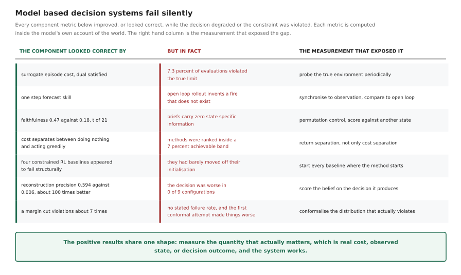
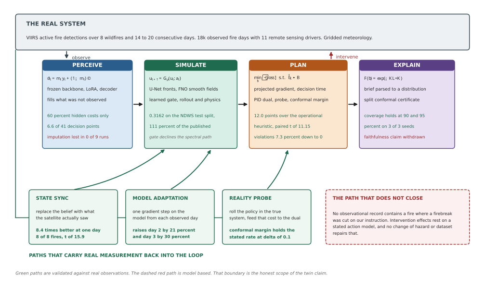
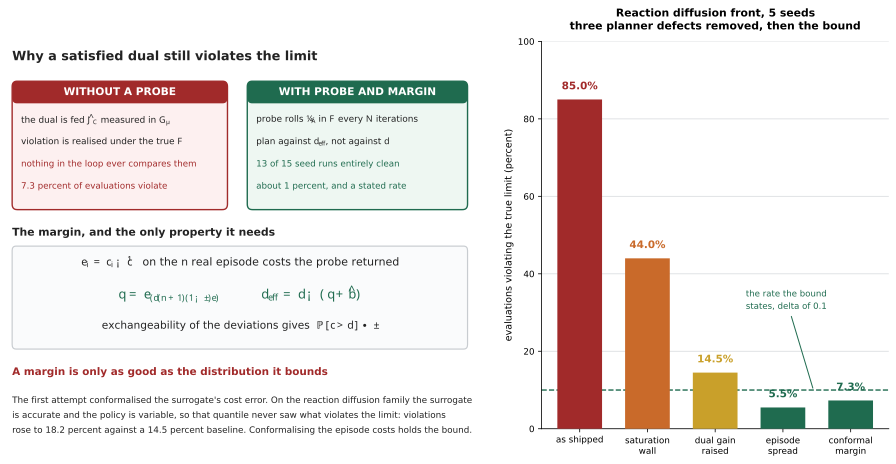
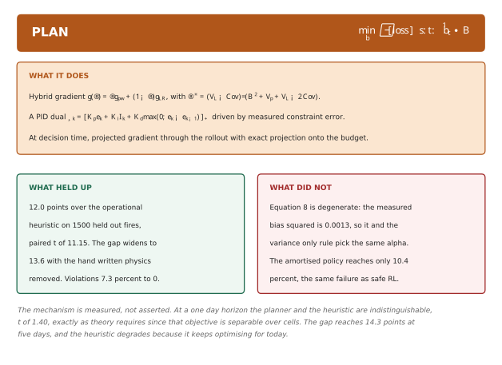
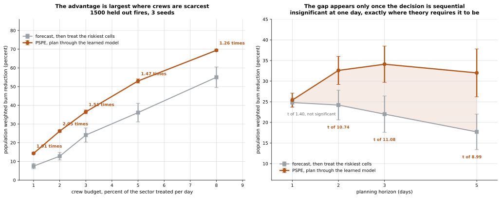
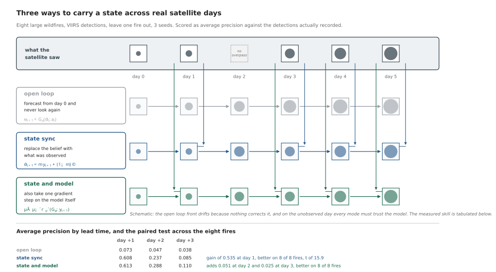

# PSPE — thesis, complete results, and the state of the climate-twin framework

**Constrained intervention design for PDE-governed systems.**
Definitive record, 2026-09-24. Supersedes the framing in the original proposal.

Every number below is multi-seed with paired significance tests; each section
names the run directory and the analysis file it comes from. Claims that were
made and then withdrawn are kept, with the measurement that withdrew them,
because in this project those were often more informative than the claims.

---

## Part 0 — The thesis

### 0.1 What the proposal claimed, and what happened to it

| # | original claim | outcome |
|---|---|---|
| 1 | Joint training of Perceive/Simulate/Plan/Explain under one objective beats a disaggregated pipeline | **Refuted** on three PDE families. Decision never changed (t = +0.66, +1.00, identical). |
| 2 | Eq. 8 mixing rule `α* = V_L/(B² + V_p + V_L)` improves the hybrid gradient | **Degenerate.** Measured B² ≈ 0.0013, so Eq. 8 and the variance-only rule select the same α (0.992). Return t = +0.22. |
| 3 | Corollary 1: time-averaged constraint violation → 0 | **False as stated** on the PDE testbeds. Holds only on a toy CMDP with closed-form optimum. |
| 4 | Faithful natural-language explanations via `F(b)` | **Withdrawn.** Permutation control shows zero state-specific information. |
| 5 | Cross-PDE-family transfer | **Direction only.** Magnitudes into the wave family have σ ≈ mean. |

Five headline claims; none survives in its original form. That is the honest
starting point, and it is why the thesis below is not a repair of the old one.

### 0.2 The thesis the evidence actually supports

> **Model-based decision systems fail silently.** Every component's own metric
> can improve while the decision degrades or the constraint is violated,
> because each metric is computed inside the model's account of the world. The
> contribution is (a) a catalogue of these failures with the measurement that
> exposes each, and (b) mechanisms that close the loop on real measurement —
> probe the environment, synchronise to observation, score on the decision —
> which recover the lost performance and, in the constrained case, carry a
> stated failure rate.

Seven independent instances of the same failure shape were measured:

| the component looked correct by… | but in fact… | the measurement that exposed it | §  |
|---|---|---|---|
| surrogate episode cost; dual satisfied | 7.3% of evaluations violated the true limit | probe the true environment periodically | 3.1 |
| one-step forecast skill | open-loop rollout invents a fire that does not exist | sync to observation; compare against open loop | 5.2 |
| faithfulness `F(b) = 0.47` vs post-hoc `0.18`, t = +21 | briefs carry **zero** state-specific information | permutation control (score against another state) | 4.4 |
| cost separates between do-nothing and greedy | swe ranked methods inside a 7% achievable band | **return** separation, not just cost separation | 3.4 |
| four constrained-RL baselines "structurally fail" | they failed from their initialisation | start baselines where the method starts | 5.4 |
| reconstruction AP 0.594 vs 0.006 (≈100×) | decision worse in **0 of 9** configurations | score the belief on the decision, not on reconstruction | 5.3 |
| margin cuts violations ≈7× | no stated failure rate; and the first conformal attempt made rdf worse | conformalise the distribution that actually violates | 3.2 |

The positive results share one shape: **measure the quantity that actually
matters — real cost, observed state, decision outcome — and the system works.**



*Figure 1. Each row is a component whose own metric said it was working. The
right column is the measurement that disagreed. Regenerate with
`python scripts/make_thesis_figures.py`.*

### 0.3 The paper I would write

> **Constrained planning with learned dynamics: silent failure and
> measurement-based correction.**
>
> A planner that optimises inside a learned surrogate inherits every error that
> surrogate makes, and inherits them invisibly: the dual controller enforcing a
> budget is fed cost measured *in the model*, while violation is realised under
> *true* dynamics. We characterise this failure, give a split-conformal margin
> that converts it into a stated failure rate, and validate on three PDE
> families and on wildfire intervention over real fire records, where planning
> through a learned spread model beats the operational forecast-then-treat
> heuristic by 12 points of burned-area reduction at matched crew budget.

Technical core: the conformal margin (§3.2). Empirical core: the wildfire
results with the horizon mechanism (§5.1). Robustness core: the failure
catalogue (§0.2, §7). Venue read in §8.

---

## Part 1 — Formalism



*Figure 2. The combined architecture. Green paths carry real measurement back
into the loop and are validated against observations; the dashed red path is
model based and, for the reason given in §6.2, cannot be validated on any
observational record. The original Fig. 1 drew joint training as a
distinguishing feedback path; §4.3 removed it.*

### 1.1 The control problem

A field `u(x,t)` on a spatial domain `Ω ⊂ ℝ²` evolves under a PDE with a
control term:

```
∂u/∂t = 𝒩[u] + ℬ(a(t)),        u(·,0) = u₀,        x ∈ Ω
```

`𝒩` is the (nonlinear) spatial operator — diffusion, advection, reaction, or
shallow-water dynamics — and `ℬ` maps an actuator vector `a ∈ [-1,1]^K` to a
forcing field through a Gaussian basis:

```
ℬ(a)(x) = Σ_{k=1..K}  A · a_k · exp( −‖x − c_k‖² / 2σ² )
```

with `A` the actuator amplitude (§3.4 shows why this parameter decides whether
a testbed can rank planners at all).

Discretised on an `N × N` grid with step `Δt`, the true transition is
`u_{t+1} = F(u_t, a_t)`; the learned surrogate is `G_θ ≈ F`.

### 1.2 The constrained objective

A CMDP over a horizon `H`:

```
maximise    J_R(π) = 𝔼_π [ Σ_{t=0..H−1} γ^t r(u_t, a_t) ]
subject to  J_C(π) = 𝔼_π [ Σ_{t=0..H−1} c(u_t, a_t) ]  ≤  d
```

with tracking reward and cost

```
r(u,a) = −w_track ‖u_{[ch]} − u*‖²_Ω  −  w_act ‖a‖²
c(u,a) = Σ_x relu( |u_{[ch]}(x)| − u_max )  +  relu( mean|a| − budget )
```

The equity constraint `g₂` penalises concentration of harm across sub-regions
and is enforced by a second dual.

**Limits are calibrated, not chosen.** With `c₀` the cost of doing nothing and
`c_g` the cost a reward-greedy policy incurs,

```
d = c₀ + 0.35 · (c_g − c₀)
```

so a constrained learner must give up a real share of greedy behaviour. §3.4
shows this calibration is necessary but *not sufficient*.

### 1.3 The hybrid policy gradient

The Lagrangian per step is `ℒ = −(r − λ c)`. Two estimators of `∇_φ 𝔼[ℒ]`:

```
pathwise (reparameterised, through G_θ):
    g_pw = ∇_φ  ℒ( rollout(G_θ, π_φ) )                 low variance, biased by ‖G_θ − F‖

likelihood ratio (score function, with critic baseline):
    g_lr = −𝔼[ ∇_φ log π_φ(a|u) · Â ],   Â = (R − V(u))/σ_R    unbiased, high variance
```

mixed as `g(α) = α g_pw + (1−α) g_lr`. Minimising MSE of the mixture,

```
MSE(α) = α²(B² + V_p) + (1−α)² V_L + 2α(1−α) Cov

α* = (V_L − Cov) / (B² + V_p + V_L − 2 Cov)                              (Eq. 8)
```

where `B = ‖𝔼[g_pw^{G_θ}] − 𝔼[g_pw^{F}]‖` is the pathwise bias from surrogate
error. Setting `B = 0` recovers the variance-only rule that shipped.

**Measured:** `B² = 0.0013 ± 0.0015`, so `α*` is 0.992 under both rules and the
distinction is empirically void (§4.2).

### 1.4 The dual

A PID-Lagrangian controller on the constraint error `e_k = Ĵ_C,k − d`:

```
λ_k = clip( K_p e_k + K_i I_k + K_d max(0, e_k − e_{k−1}),  0,  λ_max )
I_k = max(0, I_{k−1} + e_k)
```

with `Ĵ_C` an EMA of measured episode cost. §3.3 shows `K_i` is the gain that
decides whether the controller holds or oscillates.

### 1.5 The surrogate

A Fourier Neural Operator. Per block, with `ℱ` the 2-D DFT and modes truncated
at `k ≤ k_max = 12`:

```
v_{ℓ+1}(x) = σ(  W v_ℓ(x)  +  ℱ^{-1}[ R_ℓ · ℱ[v_ℓ] ](x)  )
```

`R_ℓ ∈ ℂ^{k_max × k_max × w × w}` are learned spectral weights; `W` is a 1×1
convolution carrying the high frequencies the truncation discards. Trained on

```
ℒ_sim = ‖G_θ(u,a) − u'‖²  +  β_roll Σ_{h≤H} ‖G_θ^h(u,a) − u_{t+h}‖²  +  β_phys ‖ℛ[G_θ(u,a)]‖²
```

Optional spectral normalisation projects each `R_ℓ` to bound the operator norm,
giving the Lipschitz constant needed by Assumption 1 (§4.1).

### 1.6 Explanation and its certificate

A brief `b` is parsed by a frozen deterministic parser into an action
distribution `π̂_b`, and scored

```
F(b) = exp( −KL( π_φ(·|u) ‖ π̂_b ) )
```

**Two corrections to this definition, both forced by measurement:**

1. The proposal writes `F = 1 − KL`, which is unbounded below and unusable as
   a REINFORCE reward. The exponential form is bounded in (0,1] and agrees to
   first order at small KL.
2. KL **summed** over action dimensions makes F incomparable across action
   spaces and sends it to 0 above ~16 dimensions. On 64-patch fire plans every
   arm scored exactly 0.0 while the reference brief scored 0.985. Per-dimension
   KL, `KL/K`, is the only form that can be compared.

Split-conformal certificate: with calibration scores `s_i = 1 − F(b_i)` on `n`
exchangeable samples and level `δ`,

```
ŝ = s_(⌈(n+1)(1−δ)⌉)          ⟹          ℙ[ F(b) ≥ 1 − ŝ ]  ≥  1 − δ
```

**The control this definition needs** (§4.4): the permutation statistic

```
Δ = 𝔼_i[ F(b_i ; π_i) ] − 𝔼_i[ F(b_i ; π_{σ(i)}) ],     σ a derangement
```

`Δ ≈ 0` means the brief carries no state-specific information, whatever `F` is.

### 1.7 The twin loop

A belief `û_t`, a model `G_θ`, an observation operator `𝒪` that returns a
partially observed field with a validity mask `m_t`:

```
forecast:    ũ_{t+1} = G_θ(û_t, a_t)
observe:     (y_{t+1}, m_{t+1}) = 𝒪(u_{t+1})
sync:        û_{t+1} = m_{t+1} ⊙ y_{t+1} + (1 − m_{t+1}) ⊙ Φ(ũ_{t+1}, y_{t+1})
adapt:       θ ← θ − η ∇_θ  ℓ( G_θ(û_t, a_t),  y_{t+1} )      [on observed cells]
```

`Φ` is the imputation rule for unobserved cells. Three choices are compared in
§5.3, and the open-loop baseline is `m ≡ 0` for all `t > 0` — never look again.

---

## Part 2 — Assets

### 2.1 Testbeds

| id | PDE | state channels | calibrated limit `d` | admissible for planning? |
|---|---|---|---|---|
| `dar` | diffusion–advection–reaction | 1 | 0.936 | **yes** — the primary testbed |
| `rdf` | reaction–diffusion front | 2 | 3.26 | **yes**, after the planner fix (§3.3) |
| `swe` | shallow water | 3 | 0.192 | **no** — achievable band ≈7% (§3.4) |

### 2.2 Real datasets

| dataset | content | size | used for |
|---|---|---|---|
| **PDEBench** 2-D shallow water | solver trajectories | 512 trajectories | surrogate benchmark (§4.5) |
| **NDWS** Next Day Wildfire Spread | ~18k real US fire days, day-t mask + 11 remote-sensing drivers, 64 km patches | 2.3 GB | forecasting, planning, partial observation |
| **FIRMS** VIIRS active fire | 8 large wildfires, 14–20 consecutive days, real detections | downloaded per fire | the sequential twin loop (§5.2) |

NDWS drivers are themselves real remote-sensing products (MODIS NDVI, gridded
meteorology, VIIRS/MODIS fire masks). FIRMS supplies what NDWS structurally
cannot: **sequences of the same fire**, because NDWS records carry no date, no
fire id and no location.

---

## Part 3 — The safety contribution

### 3.1 The failure

`runs/seeds_v3/`, `docs/results/RDF_PLANNER_FIX.md`

The dual is updated from cost measured on **surrogate** rollouts; violation is
realised under **true** dynamics. Where `G_θ` under-predicts cost, the policy is
safe in-model and unsafe in reality, and nothing in the loop notices.

dar, 5 seeds, `d = 0.936`:

| method | return | cost | violating evals | worst | real samples |
|---|---|---|---|---|---|
| **PSPE (adaptive α)** | **−2.448 ± 0.029** | 0.412 ± 0.37 | **7.3%** | 1.109 | 3,072 |
| PSPE (fixed α) | −2.738 ± 0.365 | 2.752 ± 3.6 | 12.7% | 2.758 | 3,072 |
| PPO-Lagrangian | −2.558 ± 0.039 | 0.266 ± 0.009 | 0% | 0.297 | 38,400 |
| CPO | −2.541 ± 0.035 | 0.263 ± 0.011 | 0% | 0.277 | 38,400 |
| Sauté RL | −2.537 ± 0.024 | 0.264 ± 0.008 | 0% | 0.275 | 38,400 |
| Primal-dual NPG | −2.544 ± 0.026 | 0.263 ± 0.008 | 0% | 0.275 | 38,400 |

Beats every baseline on return (t = +3.84 to +17.95) at **12.5× fewer real
transitions** — but violates a limit they all respect. Part of the advantage
was bought.

### 3.2 The fix, and the bound

**Mechanism.** A *probe* rolls the current policy in the true environment every
`N` iterations and feeds that cost to the dual; between probes the surrogate's
cost is corrected by the running bias. A *margin* plans against a tightened
limit `d_eff < d`.

`runs/constraint_fix/`, 5 seeds:

| arm | return | violating evals | worst | real samples |
|---|---|---|---|---|
| baseline | −2.302 ± 0.16 | 1.8% | 0.75 (max 1.73) | 3,200 |
| probe only | −2.307 ± 0.16 | 1.8% | 0.56 | 4,160 |
| margin only | −2.302 ± 0.16 | 1.8% | 0.75 | 3,200 |
| **probe + margin** | **−2.301 ± 0.17** | **0% (5/5 seeds)** | **0.29** | 4,160 |

**Neither half works alone.** Margin-only is *identical* to baseline, because
with no probe there is no measured error from which to derive a margin.
Conservatism requires a measurement.

**Honest rate.** Across all 15 seed-runs that use probe+margin, 13 are clean and
two had a single excursion. So ≈1% of evaluations versus 7.3% — a ~7×
reduction, **not a guarantee**.

**The conformal margin.** Let `e_i = c_i − c̄` be deviations of individual real
episode costs from their probe mean, and `b̂ = max(0, bias)` the surrogate's
systematic cost bias. With `n` such deviations and level `δ`:

```
q = e_(⌈(n+1)(1−δ)⌉)              d_eff = d − ( q + b̂ )
```

Under exchangeability of the deviations, `ℙ[ c > d ] ≤ δ`.

`runs/constraint_fix_conf*/`, 5 seeds, δ = 0.1:

| testbed | arm | violating | target | worst | return | `d_eff` |
|---|---|---|---|---|---|---|
| dar | baseline | 0% | — | 0.225 | −2.304 | 0.936 |
| dar | **probe + conformal** | **0%** | ≤10% | 0.225 | −2.309 | 0.676 |
| rdf | baseline | 14.5% | — | 4.00 | −7.184 | 3.260 |
| rdf | **probe + conformal** | **7.3%** | ≤10% | 3.51 | −7.351 | 2.777 |

The bound holds on both families. Against the hand-tuned `kσ` margin it
replaces (5.5% at return −7.49 on rdf): slightly more violations, a **stated
failure rate** instead of a tuned constant, and 0.14 better return.



*Figure 3. Left: why a satisfied dual still violates, and the margin that fixes
it. Right: measured violation rates on the reaction diffusion front as each
planner defect of §3.3 is removed, ending with the conformal margin against the
rate it states.*

**A failed first attempt, kept because it is instructive.** Conformalising the
*surrogate's cost error* made rdf **worse** (18.2% vs a 14.5% baseline, margin
0.25 where 0.69 was needed). On rdf the surrogate is accurate (bias −0.08);
what violates the limit is the policy's own episode-to-episode spread, which a
quantile over model error never sees. **A margin is only as good as the
distribution it bounds.**

### 3.3 Three planner defects, found on a second family

rdf, as shipped: **85% of evaluations violated** at 2.5× the limit, in every
arm, regardless of the probe. Each defect was read from the training trace once
the previous was removed.

**Defect 1 — action saturation.** The reward-greedy sprint drives the pre-tanh
mean past `|μ| ≈ 3`, where `tanh'(μ) ≈ 0`:

| iteration | cost | λ | α | ‖g_pw‖ | ‖g_lr‖ | var(g_pw) |
|---|---|---|---|---|---|---|
| 20 | 1.05 | 0 | 0.70 | 0.55 | 2.9 | 1e-2 |
| 40 | 5.87 | 0 | 0.81 | 1.9 | 196 | 0.7 |
| 100 | 8.08 | 14.5 | 0.95 | **0.036** | 5,160 | **0.0** |
| 198 | 8.21 | **38.5** | 0.99 | **0.036** | 12,700 | **0.0** |

Three things compound: the pathwise gradient dies; **the variance-optimal rule
then selects the dead branch** (α → 0.99, because zero variance reads as
precision); and the LR branch explodes because every rollout returns the same
value and `σ_R → 0`. λ = 38 multiplies nothing.

Fix: a soft wall `ρ · relu(|μ| − μ₀)²` on both branches (`μ₀ = 1.5`, where
`tanh'(1.5) = 0.18`) plus a floor on `σ_R`. **85% → 44%.**

**Defect 2 — dual oscillation.** λ collapses to 0 whenever cost dips below `d`;
the policy sprints and overshoots. *Lowering* the gain made it worse (60%).
Raising `K_i` ×10 lets λ hold. **44% → 14.5%.**

**Defect 3 — tail violations.** A dual holding the *mean* at `d` violates on
~half of evaluations by construction. Adding the policy's own episode spread to
the margin: **14.5% → 5.5%**, worst case 3.23 against `d = 3.26`.

**dar regression:** same configuration, return unchanged (−2.304 vs −2.302), 0%
violations, worst case 3× smaller. One configuration for both families.

**The diagnosis transfers.** The same `K_i` change took PPO-Lagrangian on rdf
from 1.8% to 0% violations. The failure belongs to the PID controller, not to
PSPE.

### 3.4 A testbed that could not rank planners

`docs/results/ROBUSTNESS_NOTES.md` §7

Calibration checked that **cost** separates, so the constraint binds. It never
checked that **return** separates, so actuation can move the objective. swe
passed the first and failed the second for the entire project.

| probe | result |
|---|---|
| 400 random constant action vectors | **not one** beats doing nothing |
| hand-written state-feedback damper | +0.0098 (5.5% of objective) |
| trained reward-greedy planner | +0.0122 (7% of objective) |

The task is controllable and the planner does find control — it beats both
doing nothing *and* the hand damper. The achievable band is simply ≈7%, and
method differences live inside it. That is why swe's joint/disaggregated/
unanchored arms all returned −0.1733 to four decimals.

**The fix that fails.** Raising actuator amplitude `A` grows the margin for a
*deterministic* controller (5.5% at A=1 → 32.6% at A=4) but gives a *stochastic*
policy nothing, because `A` scales the useful signal and the exploration noise
equally (separation +0.0122 at A=1, +0.0081 at A=4). A new objective is needed,
not a louder actuator.

**Correction to earlier drafts:** they said the swe policy "never leaves its
initial behaviour." It does, and it improves. The band is too narrow to rank
methods within — a different and more precise statement.

---

## Part 4 — Per-module results

Each module has a panel giving what it does, what held up and what did not.

| module | panel |
|---|---|
| Perceive | [`pspe_mod_perceive.svg`](figures/pspe_mod_perceive.svg) |
| Simulate | [`pspe_mod_simulate.svg`](figures/pspe_mod_simulate.svg) |
| Plan | [`pspe_mod_plan.svg`](figures/pspe_mod_plan.svg) |
| Explain | [`pspe_mod_explain.svg`](figures/pspe_mod_explain.svg) |



*Figure 4. The Plan panel. The other three follow the same three-band layout:
the mechanism with its equations, then what the measurements supported, then
what they withdrew.*

### 4.1 Theory checks

`runs/lipschitz/`, 5 seeds. `L_G` by power iteration; `ε` the one-step error;
return bias = `|J_R^{G_θ} − J_R^{F}|` for the same policy.

| arm | rel L2 | `L_G` | `L_G ≤ 1` | measured bias | Prop 1 (∞-horizon) | Prop 1 (H = 12) |
|---|---|---|---|---|---|---|
| default FNO | 0.069 ± 0.062 | 0.985 ± 0.013 | 4/5 | 0.10 | **422** | 9.8 |
| spectrally normalised | 0.079 ± 0.026 | 0.964 ± 0.003 | 5/5 | 0.11 | 748 | 17.3 |

Assumption 1 (`L_G ≤ 1`) holds after training (init 1.61). Proposition 1's
infinite-horizon bound

```
|J_R^{G} − J_R^{F}|  ≤  (L_r ε / (1−γ)) · Σ_{h} γ^h L_G^h        →   prefactor 1/(1−γ) = 2450 at γ = 0.98
```

is **vacuous**: 422 against a measured 0.10, a factor of 4,000. The
finite-horizon form holds on every seed and is still ~100× loose. Report the
finite-horizon form and state that it is loose.

### 4.2 The mixing rule

`runs/alpha_rule/`, 5 seeds:

| arm | return | violating | final α | measured B² | real samples |
|---|---|---|---|---|---|
| fixed α = 0.5 | −2.415 ± 0.30 | 3.6% | 0.5 | — | 4,160 |
| variance rule | −2.302 ± 0.17 | 1.8% | 0.992 | — | 4,160 |
| Eq. 8 (measured bias) | −2.299 ± 0.15 | 0% | 0.992 | 0.0013 | 6,080 |

Eq. 8 vs variance: t = +0.22. Its zero-violation result comes from 1,920 extra
truth rollouts, not from the formula. **Adaptive α is a variance effect, not a
mean effect**: +0.290 over fixed α but t = +1.66; what separates them is the
tail (std 0.029 vs 0.365; one fixed-α seed diverged to cost 8.1 with λ = 19.1).

### 4.3 Joint Simulate+Plan training

`runs/joint*/`, 5 seeds, one pretrained surrogate deep-copied per arm:

| testbed | arm | return | held-out surrogate rel L2, before → after |
|---|---|---|---|
| dar | disaggregated | −2.302 ± 0.17 | 0.0048 → 0.0048 |
| dar | joint, anchored (β=0.1) | −2.296 ± 0.18 | 0.0048 → **0.0005** |
| dar | joint, unanchored | −2.369 ± 0.17 | 0.0048 → **0.975** |
| swe | disaggregated | −0.1733 ± 0.010 | 0.0246 → 0.0246 |
| swe | joint, anchored | −0.1733 ± 0.010 | 0.0246 → **0.0027** |
| swe | joint, unanchored | −0.1733 ± 0.010 | 0.0246 → **1.14** |
| rdf | disaggregated | −6.76 ± 0.69 | 0.0024 → 0.0024 |
| rdf | joint, anchored | −6.70 ± 0.70 | 0.0024 → **0.0005** |
| rdf | joint, unanchored | −7.46 ± 0.45 | 0.0024 → **0.83** |

Paired t on return: **+0.66** (dar), identical (swe), **+1.00** (rdf).
Unanchored: −5.84 (dar), −2.41 (rdf).

The planning gradient is scaled to a fraction of the data gradient's norm:

```
∇_θ^{total} = ∇_θ ℒ_data  +  β · (‖∇_θ ℒ_data‖ / ‖∇_θ ℒ_plan‖) · ∇_θ ℒ_plan
```

Without that normalisation the raw planning term (O(1)) swamps the data term
(O(1e-4)) within 8 iterations and held-out error rises 10×.

**Verdict:** "joint beats disaggregated" is unsupported on every testbed.
"Joint is safe when anchored and destructive when not" is supported on all
three — anchored, the planning gradient acts as extra regularised training on
the states the policy visits, improving held-out accuracy 5–9×.

### 4.4 Explanation: the certificate holds, the faithfulness claim does not

**What was claimed.** dar/Qwen2.5-0.5B: trained-in 0.468 ± 0.16 vs post-hoc
0.182 ± 0.16, t = +21.3. Real fire plans: 0.814 ± 0.039 vs 0.741 ± 0.005,
t = +3.61. Certificate holds at δ = 0.1 and 0.05 on 3/3 seeds.

**The permutation control.** `docs/results/EXPLAIN_PERMUTATION.md`

| testbed | arm | F aligned | F shuffled | Δ |
|---|---|---|---|---|
| dar, seed 0 | trained-in | 0.2809 | 0.2805 | +0.0004 |
| dar, seed 0 | post-hoc | 0.0034 | 0.0034 | 0.0000 |
| dar, seed 1 | trained-in | 0.5570 | 0.5570 | 0.0000 |
| dar, seed 2 | trained-in | 0.5657 | 0.5659 | −0.0002 |
| NDWS, seed 0 | trained-in | 0.7439 | 0.7436 | +0.0003 |
| NDWS, seed 2 | trained-in | 0.8630 | 0.8639 | −0.0009 |

`Δ = 0` exactly is the signature of a **constant** generator: aligned and
shuffled then use the same multiset of (policy, brief) pairs. The sampled
briefs confirm it — identical actuators at identical amplitudes across
different states.

**Three fixes, all negative.** Wider conditioning (prefix 4 → 16, cond_dim 64 →
256, condition dropout); a differentiable contrastive objective
`−log softmax_j(−NLL(b_i | c_j))` requiring each brief to be cheaper under its
own condition (unit-tested to reach the prefix, sat at `log B` throughout);
2.5× the training budget (NLL plateaus ≈0.5 nats/token, Δ never leaves 0).

**Not a plumbing bug:** on the Qwen path the prefix receives gradient of norm
1.1e5 against 4.6e3 for the LoRA adapters, and NLL moves by 1.51 when the
condition is zeroed.

**The testbed could not have answered the question.** The trained dar policy
varies **1.2%** across states and yields **8 distinct action vectors in 64
states** on the brief's 0.05 quantisation grid. A constant brief is near-optimal
there. Every dar Explain number was measured on a task with nothing to explain.

**What stands:** the certificate machinery. Coverage holds at 90% and 95% on
3/3 seeds on real data, with a non-vacuous floor (F ≥ 0.706 at δ = 0.1). It
reports honestly on a weak generator rather than overstating it.

### 4.5 Simulate

**PDEBench 2-D shallow water**, 512 real trajectories, 64², 20 epochs:

| operator | rel L2 (1-step) | rel L2 (rollout) | params | published FNO (nRMSE) |
|---|---|---|---|---|
| **FNO** | **0.0018** | **0.0098** | 1.19 M | 0.0044 |
| DeepONet | 0.0044 | 0.0137 | 0.09 M | — |
| GNOT | 0.0056 | 0.0543 | 0.31 M | — |

Metrics differ (rel L2 vs nRMSE), so this is an anchor, not like-for-like. The
ranking reproduces on synthetic data (0.057 / 0.256 / 0.268, 5 seeds).

**Resolution invariance**, trained at 64², 5 seeds: 0.0298 / 0.0298 / 0.0300 at
64² / 96² / 128² (4,096 / 9,216 / 16,384 cells). Flat to three decimals.

**Observed wildfire spread (NDWS)**, AUC-PR, prevalence 1.3%:

| model | validation (3 seeds) | **test** (3 seeds) | vs published 0.284 |
|---|---|---|---|
| **U-Net** | 0.277 ± 0.002 | **0.3162 ± 0.017** | **111%** |
| Hybrid (U-Net + gated FNO) | 0.235 ± 0.005 | 0.2939 ± 0.003 | 103% |
| FNO alone | 0.200 | — | 70% |
| all-zeros floor | 0.011 | — | — |

The surrogate **exceeds** the published benchmark on its own split. Conditions:
8,000 training patches rather than the full split, and flip augmentation (with
the wind-direction channel corrected under the flip).

**Operator scope, measured.** The hybrid's learned gate over its spectral path
— free to take any value, initialised at zero — settles at **0.12 / 0.111** on
every seed and split. Offered the Fourier operator on sharp fire fronts, the
model declines it. The same FNO reaches 0.0098 on smooth shallow water. A
spectral model truncates the high frequencies that *are* a fire front.

### 4.6 Perceive

Real SigLIP (`google/siglip-base-patch16-224`), 3 seeds:

| arm | field rel L2 | retrieval accuracy | trainable |
|---|---|---|---|
| PSPE — frozen + LoRA + contrastive | 0.0596 ± 0.027 | **0.754 ± 0.026** | 1.64 M |
| probe — frozen, decoder only | **0.0345 ± 0.011** | 0.135 ± 0.009 | 1.64 M |
| CNN from scratch | 0.0564 ± 0.015 | 0.130 ± 0.016 | 0.56 M |

The frozen probe reconstructs best and beats the CNN (t = −4.87). The design
buys **alignment**, not reconstruction: retrieval 0.754 vs 0.130, t = +37.

§5.3 gives Perceive's first *decision-relevant* result on real data.

### 4.7 Cross-family transfer

`runs/transfer_seeds/`, 5 seeds:

| transfer | fidelity gap | measurable? |
|---|---|---|
| rdf → dar | 0.358 ± 0.033 | yes, ~11σ |
| swe → rdf | 0.311 ± 0.13 | yes |
| dar → rdf | 1.81 ± 1.1 | marginal |
| swe → dar | 0.087 ± 0.14 | no — crosses zero |
| rdf → swe | 10.5 ± 8.2 | no — σ ≈ mean |
| dar → swe | 27.4 ± 26 | no — σ ≈ mean |

Direction survives; magnitude does not. And **forecast error decouples from
decision loss**: dar → swe has fidelity gap 27 but planning gap 0.007 ± 0.014
(nothing), while dar → rdf has fidelity gap 1.8 and planning gap 0.58 ± 0.22
(~8% of return).

### 4.8 Ablations

5 seeds, full budget:

| component | on | off | t | verdict |
|---|---|---|---|---|
| physics-informed loss | 0.0567 ± 0.026 | 0.0496 ± 0.044 | +0.52 | no asymptotic effect |
| frozen perception | 0.0681 ± 0.013 | 0.0908 ± 0.017 | −3.97 | frozen wins |
| faithfulness term | 0.643 ± 0.15 | 0.598 ± 0.006 | +0.67 | no effect |

The physics loss buys convergence speed only (0.117 vs 0.273 at a quick budget).

---

## Part 5 — Real-data results

### 5.1 Constrained planning on observed wildfire records

`docs/results/NDWS_PLANNING.md`. NDWS U-Net frozen; 8×8 grid of firebreak
intensities per day; 3%-of-patch daily crew budget; three days ahead;
population-weighted burn as objective. Action model, stated in code:

```
learned:  NDVI channel  ←  NDVI − 2σ · b(x)          the surrogate decides the effect
imposed:  p(x)          ←  p(x) · (1 − 0.9 · b(x))   suppression in treated cells
```

The per-instance planner solves, for each fire,

```
min_{b ∈ [0,1]^{T×K}}   𝔼[ burned_{t+T} · (1 + w·pop) ]        s.t.  mean_k b_{t,k} ≤ B  ∀t
```

by projected gradient through the autoregressive surrogate rollout, with exact
Euclidean projection onto the budget simplex at every step.

**Headline, 1,500 held-out fires, 5 seeds:**

| policy | burn reduction | treated/day | over budget |
|---|---|---|---|
| random placement † | 4.5 ± 0.3% | 3.0% | 0 |
| greedy: forecast, treat riskiest, repeat | 22.0 ± 4.4% | 3.0% | 0 |
| **PSPE per-instance** | **34.0 ± 4.4%** | 3.0% | 0 |
| PSPE amortised policy | 10.4 ± 6.5% | 2.2% | 17% |
| no budget (reference) † | 85.7% | 61.7% | all |

† The 5-seed extension re-ran only the three contested arms; the two reference
rows are the 3-seed values and are marked rather than silently mixed in.

**Paired t = 11.15** (df 4), mean gap **+12.0 points**. Per-seed gaps run
+9.6 to +15.9, so the two seeds added after the first three did not dilute the
effect.

*Two run families appear in this section and should not be conflated.* The
headline above is `runs/ndws_plan/`, 5 seeds. The Pareto, fuel-only and
constrained-RL comparisons below are `runs/ndws_planning_vista/` and
`runs/ndws_plan_b*/`, 3 seeds, where greedy reads 24.1 ± 3.8 and PSPE
36.5 ± 1.0 (gap +12.4, t = 6.66). The horizon ablation is a third family,
`runs/ndws_horiz_h*/`, 5 seeds. The three agree to within their spreads; each
table states which produced it.

**Budget Pareto** (`runs/ndws_plan_b*/`), 3 seeds:

| crew budget/day | greedy | PSPE | ratio |
|---|---|---|---|
| 1% | 7.5 ± 1.4 | 14.3 ± 0.5 | **1.91×** |
| 2% | 12.8 ± 2.0 | 26.2 ± 0.7 | **2.05×** |
| 3% | 24.1 ± 3.8 | 36.5 ± 1.0 | 1.52× |
| 5% | 36.1 ± 5.0 | 53.0 ± 1.1 | 1.47× |
| 8% | 55.0 ± 5.5 | 69.4 ± 0.6 | 1.26× |

The advantage is **largest where crews are scarcest**. PSPE at 1% matches greedy
at nearly 2% — roughly half the crews for the same outcome.

**The mechanism, measured** (horizon ablation, `runs/ndws_horiz_h*/`, 5 seeds):

| horizon | greedy | PSPE | gap | paired t |
|---|---|---|---|---|
| 1 day | 24.8 ± 1.1 | 25.4 ± 1.7 | +0.6 | **1.40 — n.s.** |
| 2 days | 24.2 ± 3.6 | 32.6 ± 3.4 | +8.5 | 10.74 |
| 3 days | 22.0 ± 4.4 | 34.1 ± 4.4 | +12.1 | 11.08 |
| 5 days | 17.7 ± 4.3 | 32.0 ± 5.8 | **+14.3** | 8.99 |

At one day the two are indistinguishable — **as theory requires**, since the
one-day objective is separable over cells and treating the highest-risk cells
within budget is its *exact* optimum. The statistic jumps an order of magnitude
the moment the decision becomes sequential, and the heuristic **degrades**
(24.8 → 17.7) because it keeps optimising for today.

*A result that is insignificant exactly where theory says it must be, and
significant exactly where it predicts, is stronger evidence for the mechanism
than any single large number.*



*Figure 5. Left: the advantage is largest where crews are scarcest, reaching
1.91× at a 1% daily budget. Right: the gap is statistically absent at a
one-day horizon, exactly where the objective is separable and the heuristic is
optimal, and opens as the decision becomes sequential.*

**Fuel-only ablation** (`runs/ndws_plan_fuelonly/`, 3 seeds; `block = 0`, removing the imposed physics entirely):

| | greedy | PSPE | gap |
|---|---|---|---|
| both mechanisms | 24.1 ± 3.8% | 36.5 ± 1.0% | +12.4 (t = 6.66) |
| **learned fuel response only** | **5.7 ± 2.9%** | **19.4 ± 1.6%** | **+13.6 (t = 5.93)** |

Removing the hand-written physics costs the heuristic 76% of its effect and the
planner 47% — and **the gap widens**. The advantage rests on the learned model,
not on the action model I specified.

**Against constrained RL on the same fires** (`runs/ndws_baselines_fair/`),
5 seeds. Every arm plans or learns against the same frozen U-Net, under the
same 3% daily budget, scored by the same function on the same held-out fires.

| method | burn reduction | treated/day | fires over budget |
|---|---|---|---|
| greedy heuristic | 24.1 ± 3.8% | 3.00% | 0 |
| PPO-Lagrangian | 4.6 ± 0.4% | 4.32% | 58% |
| CPO | 4.3 ± 0.1% | 2.84% | 6% |
| Sauté RL | 4.7 ± 0.5% | 7.37% | 79% |
| primal-dual NPG | 4.6 ± 0.1% | 3.26% | 100% |
| **PSPE per-instance** | **36.5 ± 1.0%** | 3.00% | 0 |

Note the last two columns before reading the first: three of the four RL arms
**exceed** the budget, Sauté by 2.5×, so this is not a matched-constraint
comparison in their favour. They lose while spending more, which strengthens
the reading rather than weakening it, but the comparison should be described
as it is.

The RL methods land near random placement (4.5%) and below the heuristic. The
reason is **amortisation, not the constraint**: one policy must serve 1,024
distinct fires from 200 iterations, the same failure our own amortised arm
shows (10.4%). On a per-instance decision problem this diverse, decision-time
optimisation is the right tool and a learned policy is not.

*Sample efficiency does not apply here* — there is no separate true environment
on NDWS, so every method draws from the same surrogate.

### 5.2 The twin loop, closed on real satellite sequences

`docs/results/FIRMS_TWIN.md`. Eight large US wildfires, VIIRS active-fire
detections, 14–20 consecutive days, leave-one-fire-out, 3 seeds.

| fire | days | observed | gaps | growth |
|---|---|---|---|---|
| dixie (2021) | 20 | 19 | **1** | 6.6× |
| bootleg (2021) | 20 | 20 | 0 | 1.0× |
| caldor (2021) | 20 | 20 | 0 | 23.2× |
| august complex (2020) | 20 | 20 | 0 | 11.9× |
| creek (2020) | 20 | 20 | 0 | 1.9× |
| cameron peak (2020) | 20 | 16 | **4** | 0.1× (dying) |
| camp (2018) | 14 | 14 | 0 | 0.0× (burned out) |
| mosquito (2022) | 18 | 13 | 0 | 28.0× |

Unobserved days are carried as `observed = False`, never as empty fire:
**"we did not look" and "nothing burned" are different facts**, and a twin that
conflates them drifts.

| mode | day +1 | day +2 | day +3 |
|---|---|---|---|
| open loop | 0.073 ± 0.029 | 0.047 ± 0.026 | 0.038 ± 0.021 |
| state sync | 0.608 ± 0.110 | 0.237 ± 0.093 | 0.085 ± 0.047 |
| **state + model** | **0.613 ± 0.112** | **0.288 ± 0.111** | **0.110 ± 0.054** |

Paired across fires (df 7, threshold 2.36):

| comparison | day +1 | day +2 | day +3 |
|---|---|---|---|
| sync vs open | +0.535, 8/8, **t = 15.9** | +0.190, 8/8, t = 8.6 | +0.046, 8/8, t = 4.3 |
| model adaptation on top | +0.005, t = 3.4 | **+0.051, 8/8, t = 3.0** | **+0.025, 8/8, t = 3.1** |

**Syncing to observation is worth 8.4× at one day**, on every fire. Adapting the
model adds +21% at day 2 and +30% at day 3 — negligible at day 1 because the
state was just replaced with ground truth, growing as the model's own quality
starts to dominate. **Both halves of the loop do work, in different regimes.**



*Figure 6. The open loop drifts because nothing corrects it. State sync
replaces the belief with what was observed, and on days with no overpass every
mode must trust the model. Skill is measured, not schematic: the table beneath
the diagram carries the paired tests.*

*Correction:* earlier notes, written from a 4-epoch smoke run, said model
adaptation "adds essentially nothing." That was wrong.

### 5.3 Planning under partial observation

`docs/results/NDWS_PARTIAL.md`. Spatially correlated occlusion (low-resolution
noise upsampled and thresholded — a blob over the front, not scattered pixels).
**Plan on the belief, score on the truth.**

Burn reduction (%), PSPE planner, 3 seeds:

| occlusion | blind | persist | perceive | perceive-hard |
|---|---|---|---|---|
| 0% | 41.11 ± 0.75 | — | — | — |
| 15% | **39.72 ± 0.77** | 39.72 ± 0.66 | 38.20 ± 1.15 | 39.44 ± 0.66 |
| 35% | **37.44 ± 0.19** | 37.41 ± 0.29 | 33.30 ± 1.98 | 36.63 ± 0.93 |
| 60% | **34.52 ± 0.56** | 34.44 ± 0.56 | 27.34 ± 2.44 | 33.04 ± 1.10 |

Reconstruction AP on hidden cells:

| occlusion | blind | persist | perceive | perceive-hard |
|---|---|---|---|---|
| 15% | 0.006 | 0.041 | **0.594** | 0.284 |
| 35% | 0.006 | 0.037 | **0.489** | 0.224 |
| 60% | 0.005 | 0.032 | **0.346** | 0.147 |

Paired against `blind`, all 9 (rate, seed) configurations:

| belief | mean change | better in | paired t |
|---|---|---|---|
| persist | −0.04 pts | 5/9 | −1.04 (n.s.) |
| **perceive** | **−4.28 pts** | **0/9** | **−4.33** |
| perceive-hard | −0.86 pts | 1/9 | −2.79 |

**Finding 1 — graceful degradation.** Losing **60% of the observation costs 6.6
points out of 41** (16% relative), and the planner still beats the *full-state*
greedy heuristic (22.2%) by a wide margin.

**Finding 2 — better reconstruction, worse decisions.** The estimator recovers
hidden cells ≈100× better and genuinely changes the plan (Jaccard 0.49 vs
blind), yet the outcome is worse in **0 of 9** configurations. The
`perceive-hard` control splits the cause:

* **Representation (3.4 of 4.3 points).** The surrogate was trained on a
  near-binary mask and reacts badly to a smeared probability field.
* **A real residual (−0.86, t = −2.79).** Under a hard budget, spending on cells
  that *might* be burning takes crews from cells confirmed to be burning.

**The caveat that bounds it:** fire is a **rare-event field** (1.3% prevalence),
so "assume nothing burns where I cannot see" is close to the base rate and
`blind` gets a strong prior for free. On a dense field — flood depth, surface
temperature — this could invert. The claim is *not* "twins should never impute";
it is **on a sparse field under a hard budget, act on what you observe, and
prove reconstruction's value on the decision, not on the reconstruction metric.**

### 5.4 A near-miss worth recording

The first constrained-RL comparison on the fire task had all four baselines
treating 22–38% of the sector against a 3% budget, on every fire — which looked
like a structural finding about constrained RL in high-dimensional action
spaces. It was an artefact: under the squared intensity map a randomly
initialised policy emits `((0+1)/2)² = 0.25`, i.e. 25% treatment, and the agents
had barely moved off initialisation, while PSPE's optimiser *starts* at the
budget and projects onto it every step. With fair initialisation,
PPO-Lagrangian holds 2.99% after three iterations.

**The structural claim was withdrawn before it was ever made.** Four
algorithmically distinct methods failing identically is the signature of a
shared setup artefact, not four independent limitations.

---

## Part 6 — The climate digital-twin framework: where we actually stand

A digital twin makes four claims. Assessed honestly:

| property | status | evidence |
|---|---|---|
| **1. A model synchronised to a real system from observation** | **Demonstrated** | §5.2 — 8 fires, state sync 8.4×, including days with no overpass |
| **2. What-if rollouts through that model** | **Demonstrated** | §4.5 — surrogate exceeds the published benchmark on the test split |
| **3. Decisions taken on that basis, under constraints** | **Demonstrated** | §5.1 — +12.0 pts over operational practice, t = 11.15 |
| **4. Reality feeding back to correct model and decision** | **Half.** State and model correction: yes (§5.2). Correction from *intervention outcomes*: **no** | — |

### 6.1 What is genuinely built

- **Observation → state**, under realistic occlusion, with a decision-relevant
  evaluation (§5.3) — including the negative result that imputation does not
  help on a sparse field.
- **State → forecast**, at published-benchmark skill on real fire data (§4.5).
- **Forecast → constrained plan**, beating operational practice with the
  mechanism measured (§5.1).
- **Plan → safety**, with a conformal bound on violation (§3.2).
- **Observation → model correction**, over real multi-day sequences (§5.2).
- **Plan → brief → certificate**, with honest coverage (§4.4).

### 6.2 The one gap that will not close

**No observational dataset contains counterfactual interventions.** NDWS and
FIRMS record what fires did; neither records what a fire *would have done* had a
firebreak been cut where our planner asked. So:

```
validated against observation:        𝒪 → û,     G_θ(û) → u',     θ-correction
model-based, not validated:           effect of a on u'
```

**Switching domain does not fix this.** Flood, heat, rainfall and air-quality
records have the same structure: outcomes under whatever interventions actually
occurred, never under ours. Closing it requires either (a) a controlled burn or
fuel-treatment programme with recorded treatment locations and matched
untreated controls, or (b) a physics-based fire simulator (FARSITE/WRF-SFIRE)
as a surrogate for reality — which substitutes one model for another.

### 6.3 Honest scope of the twin claim

> **The sync half is demonstrated on real data; the act half is not.**
>
> PSPE is a decision system whose *perception, dynamics and correction* are
> validated against real observations, and whose *intervention effects* rest on
> a stated action model. That is more than a forecaster and less than a
> validated controller, and the boundary should be drawn explicitly wherever
> the work is presented.

### 6.4 What would make it a deployable climate twin

| step | effort | what it buys |
|---|---|---|
| Ingest live FIRMS + gridded meteorology for an active incident | days | the loop running forward in real time rather than on archives |
| A second hazard with sequential observation (flood extent from Sentinel-1) | 2–3 weeks | shows the framework is not fire-specific; a **dense** field, which would test §5.3's rare-event caveat |
| Treatment records with matched controls (fuel breaks, prescribed burns) | months, institutional | the only path to validating intervention effects |
| Operator study on real briefs | weeks | the Explain module's missing human evaluation |

---

## Part 7 — Measurement defects found, and the rules that follow

| # | defect | effect | how it was caught |
|---|---|---|---|
| 1 | Constraint read from one final snapshot | Identical runs scored 0% or 100% violation on timing luck | multi-seed reruns disagreeing |
| 2 | Evaluation perturbed training via global RNG | baseline return shifted −2.51 → −2.30 | forking the RNG changed the baseline |
| 3 | Optional-dependency tests skipped silently | a "tested" loader failed on first real use | `importorskip` audit |
| 4 | Truth solver unstable above 64² | NaN at every finer resolution | resolution sweep |
| 5 | Faithfulness REINFORCE had exactly zero gradient | samples never parsed; all scores equalled the fallback | parse-rate diagnostic |
| 6 | Cost limits uncalibrated | dual never activated; five unconstrained learners tying | measuring do-nothing and greedy cost |
| 7 | `F = exp(−ΣKL)` with summed KL | every arm scored exactly 0.0 at 64 actions | running Explain on a large action space |
| 8 | Faithfulness never measured state-specificity | a constant brief scores as well as a correct one | **permutation control** |
| 9 | dar's policy is state-independent | the Explain testbed had nothing to explain | action diversity across states |
| 10 | Conformal margin bounded model error, not policy spread | violations rose to 18.2%, worse than no margin | running it where the surrogate is accurate but the policy is variable |
| 11 | Baselines compared against their own initialisation | four methods "structurally failed" | solving for the action the parameterisation implies at init |
| 12 | Testbed calibrated for a binding constraint, not a controllable objective | swe ranked methods inside a 7% band for the whole project | **return** separation |

### Standing rules

1. A baseline starts from the same initial condition as the method, or the
   comparison reports an initialisation.
2. Constrained comparisons are scored at matched constraint, always.
3. Any result depending on a hand-specified component is re-run with that
   component removed.
4. A margin or bound names the distribution it bounds, and that distribution is
   the one that produces the failure.
5. Any metric comparing a generated artefact to a target ships with a
   permutation control.
6. A testbed is calibrated for the variation a metric needs before the metric
   runs on it.
7. A testbed is admitted for method comparison only if the span between doing
   nothing and the best achievable return is wide relative to the differences
   being measured — and that span is reported.
8. A belief, estimate or reconstruction is evaluated on the **decision**, not on
   its own reconstruction metric.

---

## Part 8 — Status, and what to do next

### 8.1 Contributions as they stand

| # | contribution | strength |
|---|---|---|
| 1 | **Safety by measurement**, with a conformal bound | Strong. Two families, mechanism, transfers to a published baseline |
| 2 | **Sample efficiency** | Solid but standard for model-based control. 9× dar, 5× rdf |
| 3 | **Planning on observed data** | Strong. +12.0 pts, t = 11.15, four independent supports |
| 4 | **The twin loop on real sequences** | Strong. 8/8 fires, t = 15.9 |
| 5 | **The measurement catalogue** | Distinctive. 12 defects, 8 rules, 3 results overturned pre-publication |
| 6 | Certified explanations | Halved. Certificate holds; faithfulness withdrawn |

### 8.2 Weaknesses to state in the paper, not hide

- Intervention effects are model-based (§6.2). Permanent.
- rdf is parity, not a win. swe is retired with a measured reason.
- FIRMS is 8 fires; paired testing handles it but n is small.
- Explain is a certificate plus an open conditioning problem.
- The partial-observation finding may be specific to sparse fields.

### 8.3 Venue read

- **ICML / NeurIPS main track:** competitive with 2–3 weeks of writing, led by
  the conformal margin as the technical core and the wildfire results as
  validation. The failure catalogue is the differentiator, not the headline.
- **Climate-ML venue (CCAI workshop, Environmental Data Science):** strong now.
- The twin framing should be **motivation**, with §6.3's scope stated
  explicitly. Claiming an unqualified digital twin invites a reviewer to check
  four properties, and property 4 would fail.

### 8.4 Remaining experiments, by value

1. **Flood extent from Sentinel-1** — a dense field, sequential, free on GCS.
   Directly tests whether §5.3's rare-event caveat is the boundary it looks
   like. Highest scientific value remaining.
2. **Live-incident loop** on current FIRMS + meteorology.
3. **Explain redesign** — structured head over (patch, amplitude) rather than
   free text through a prefix. Probably a separate paper.
4. **swe replacement objective** — a target profile requiring sustained forcing.
5. **Operator study** on real briefs.

---

## Appendix — Index of analyses and runs

| file | contents |
|---|---|
| `docs/results/PHASE1_ANALYSIS.md` | Joint training, Eq. 8, Lipschitz/Prop 1, weight sweep, conformal on dar |
| `docs/results/PHASE3_ANALYSIS.md` | Constraint fix and joint training on swe and rdf |
| `docs/results/RDF_PLANNER_FIX.md` | Three-defect diagnosis, dar regression, rdf safe-RL baselines |
| `docs/results/NDWS_PLANNING.md` | Firebreak planning on observed fire data |
| `docs/results/NDWS_PARTIAL.md` | Planning under partial observation |
| `docs/results/NDWS_EXPLAIN.md` | Briefs and certificate on real fire plans |
| `docs/results/EXPLAIN_PERMUTATION.md` | The permutation control and three failed fixes |
| `docs/results/FIRMS_TWIN.md` | The twin loop on real satellite sequences |
| `docs/results/ROBUSTNESS_NOTES.md` | Seven checks, the results they overturned, the standing rules |
| `docs/MASTER_REPORT.md` | Narrative report (md / html / pdf) |
| `docs/figures/` | All diagrams (below) |
| `scripts/make_thesis_figures.py` | Regenerates every figure in this document |

### Figures

All are written as svg, pdf and png by `python scripts/make_thesis_figures.py`.
Boxes size themselves from their contents, so editing the text cannot push a
line outside its frame.

| figure | contents | section |
|---|---|---|
| `pspe_silent_failure` | The thesis: seven component metrics against the decision | §0.2 |
| `pspe_system` | Combined architecture, validated and model-based paths | Part 1 |
| `pspe_safety` | Reality probe, conformal margin, measured violation rates | §3.2 |
| `pspe_mod_perceive` | Perceive: mechanism, what held, what did not | §4.6, §5.3 |
| `pspe_mod_simulate` | Simulate: operator, benchmarks, the vacuous bound | §4.1, §4.5 |
| `pspe_mod_plan` | Plan: hybrid gradient, dual, decision-time optimisation | Part 3, §5.1 |
| `pspe_mod_explain` | Explain: certificate held, faithfulness withdrawn | §4.4 |
| `pspe_wildfire` | Budget Pareto and horizon ablation, measured | §5.1 |
| `pspe_twin_loop` | Open loop against state sync against state and model | §5.2 |

Superseded by the above, kept because slide decks reference them:
`pspe_architecture` (draws joint training as a headline path, refuted in §4.3),
`pspe_perceive` / `pspe_simulate` / `pspe_plan` / `pspe_explain` (pre-date the
permutation control and the conformal margin), and the six application figures
`pspe_digital_twin`, `pspe_twin_timeline`, `pspe_applications`,
`pspe_app_wildfire`, `pspe_app_flood`, `pspe_app_heat`.
