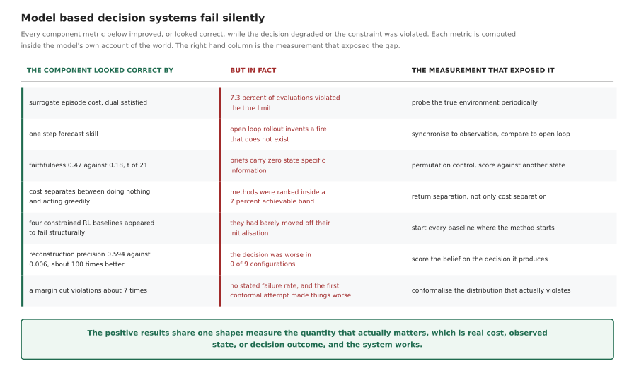
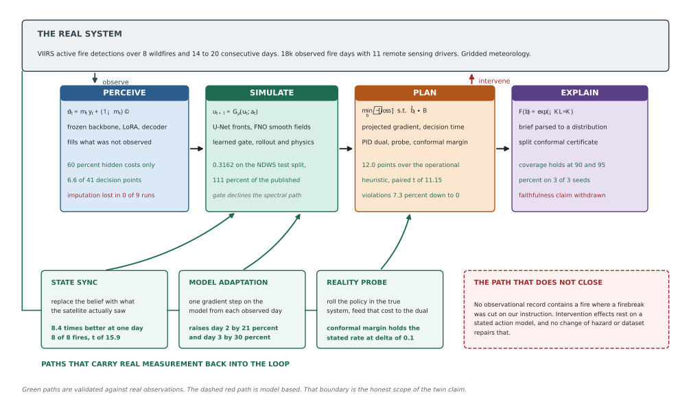
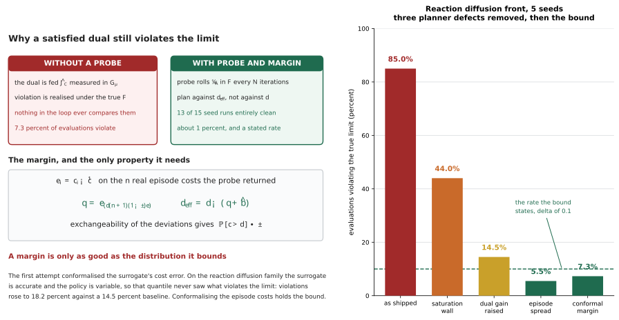
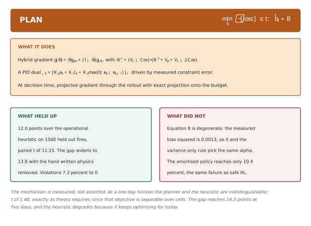
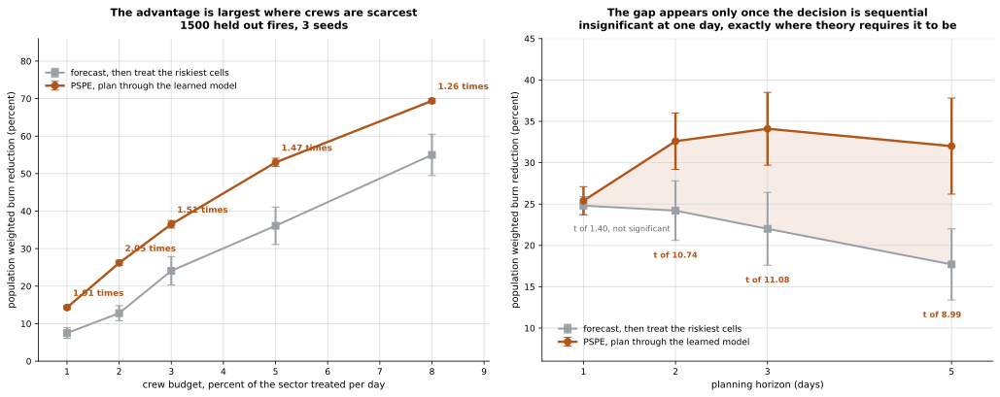
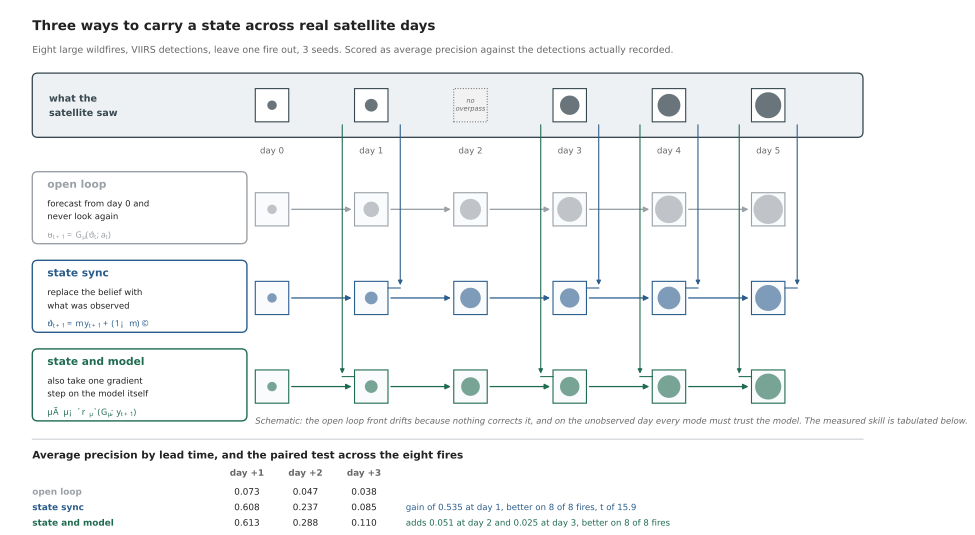

# PSPE — thesis, complete results, and the state of the climate-twin framework

**Constrained intervention design for PDE-governed systems.**
Definitive record, 2026-09-24. Supersedes the framing in the original proposal.

Every number below is multi-seed with paired significance tests; each section
names the run directory and the analysis file it comes from. Claims that were
made and then withdrawn are kept, with the measurement that withdrew them,
because in this project those were often more informative than the claims.

**Last updated 2026-09-24**, with §3.5 (the derived diagnostic and the
controlled coverage study), §5.5 (the margin on real fire dynamics, and the two
preconditions it exposed), and five further entries in the measurement-defect
catalogue. Results still pending are marked as such in place rather than
omitted; `paper/REVISION_NOTES.md` §8e pre-registers what each would mean.

**Part 9 positions every result against the current literature** and downgrades
several of them; inline notes through Parts 3 to 7 flag the nearest prior work
where each claim is made. Read §8.1 and §9.1 together — they are the two
scorecards, one against our own baselines and one against the field. The long
form of the audit is [`RELATED_WORK.md`](RELATED_WORK.md).

---

## Part 0 — The thesis

### 0.1 What the proposal claimed, and what happened to it

| # | original claim | outcome |
|---|---|---|
| 1 | Joint training of Perceive/Simulate/Plan/Explain under one objective beats a disaggregated pipeline | **Refuted** on three PDE families. Decision never changed (t = +0.66, +1.00, identical). |
| 2 | Eq. 8 mixing rule `α* = V_L/(B² + V_p + V_L)` improves the hybrid gradient | **Degenerate.** Measured B² ≈ 0.0013, so Eq. 8 and the variance-only rule select the same α (0.992). Return t = +0.22. |
| 3 | Corollary 1: time-averaged constraint violation → 0 | **False as stated** on the PDE testbeds. Holds only on a toy CMDP with closed-form optimum. |
| 4 | Faithful natural-language explanations via `F(b)` | **Withdrawn.** Permutation control shows zero state-specific information. |
| 5 | Cross-PDE-family transfer | **Direction only.** Magnitudes into the wave family have σ ≈ mean. |

Five headline claims; none survives in its original form. That is the honest
starting point, and it is why the thesis below is not a repair of the old one.

### 0.2 The thesis the evidence actually supports

> **Model-based decision systems fail silently.** Every component's own metric
> can improve while the decision degrades or the constraint is violated,
> because each metric is computed inside the model's account of the world. The
> contribution is (a) a catalogue of these failures with the measurement that
> exposes each, and (b) mechanisms that close the loop on real measurement —
> probe the environment, synchronise to observation, score on the decision —
> which recover the lost performance and, in the constrained case, carry a
> stated failure rate.

Seven independent instances of the same failure shape were measured. Several
have precedent, named in the right-hand column of §9.1; the contribution is the
catalogue and the corrections, not the discovery of the genre.

| the component looked correct by… | but in fact… | the measurement that exposed it | §  |
|---|---|---|---|
| surrogate episode cost; dual satisfied | 7.3% of evaluations violated the true limit | probe the true environment periodically | 3.1 |
| one-step forecast skill | open-loop rollout invents a fire that does not exist | sync to observation; compare against open loop | 5.2 |
| faithfulness `F(b) = 0.47` vs post-hoc `0.18`, t = +21 | briefs carry **zero** state-specific information | permutation control (score against another state) | 4.4 |
| cost separates between do-nothing and greedy | swe ranked methods inside a 7% achievable band | **return** separation, not just cost separation | 3.4 |
| four constrained-RL baselines "structurally fail" | they failed from their initialisation | start baselines where the method starts | 5.4 |
| reconstruction AP 0.594 vs 0.006 (≈100×) | decision worse in **0 of 9** configurations | score the belief on the decision, not on reconstruction | 5.3 |
| margin cuts violations ≈7× | no stated failure rate; and the first conformal attempt made rdf worse | conformalise the distribution that actually violates | 3.2 |

The positive results share one shape: **measure the quantity that actually
matters — real cost, observed state, decision outcome — and the system works.**



*Figure 1. Each row is a component whose own metric said it was working. The
right column is the measurement that disagreed. Regenerate with
`python scripts/make_thesis_figures.py`.*

### 0.3 The paper I would write

> **Constrained planning with learned dynamics: silent failure and
> measurement-based correction.**
>
> A planner that optimises inside a learned surrogate inherits every error that
> surrogate makes, and inherits them invisibly: the dual controller enforcing a
> budget is fed cost measured *in the model*, while violation is realised under
> *true* dynamics. We characterise this failure, give a split-conformal margin
> that converts it into a stated failure rate, and validate on three PDE
> families and on wildfire intervention over real fire records, where planning
> through a learned spread model beats the operational forecast-then-treat
> heuristic by 12 points of burned-area reduction at matched crew budget.

Technical core: the conformal margin (§3.2). Empirical core: the wildfire
results with the horizon mechanism (§5.1). Robustness core: the failure
catalogue (§0.2, §7).

> **Revised after the literature audit.** Each failure in the catalogue turns
> out to have precedent — silent violation under model-based constraints is
> named in safe RL, joint training restates objective mismatch, and the
> metric-versus-outcome divergence is being reported concurrently in our own
> application domain. A reviewer who knows that literature reads the catalogue
> as careful replication rather than a headline. **§9.13 states the narrower
> paper that survives Part 9**, led by the conformal margin's negative result
> against the field's default instantiation. Venue read in §8.3.

---

## Part 1 — Formalism



*Figure 2. The combined architecture. Green paths carry real measurement back
into the loop and are validated against observations; the dashed red path is
model based and, for the reason given in §6.2, cannot be validated on any
observational record. The original Fig. 1 drew joint training as a
distinguishing feedback path; §4.3 removed it.*

### 1.1 The control problem

A field `u(x,t)` on a spatial domain `Ω ⊂ ℝ²` evolves under a PDE with a
control term:

```
∂u/∂t = 𝒩[u] + ℬ(a(t)),        u(·,0) = u₀,        x ∈ Ω
```

`𝒩` is the (nonlinear) spatial operator — diffusion, advection, reaction, or
shallow-water dynamics — and `ℬ` maps an actuator vector `a ∈ [-1,1]^K` to a
forcing field through a Gaussian basis:

```
ℬ(a)(x) = Σ_{k=1..K}  A · a_k · exp( −‖x − c_k‖² / 2σ² )
```

with `A` the actuator amplitude (§3.4 shows why this parameter decides whether
a testbed can rank planners at all).

Discretised on an `N × N` grid with step `Δt`, the true transition is
`u_{t+1} = F(u_t, a_t)`; the learned surrogate is `G_θ ≈ F`.

### 1.2 The constrained objective

A CMDP over a horizon `H`:

```
maximise    J_R(π) = 𝔼_π [ Σ_{t=0..H−1} γ^t r(u_t, a_t) ]
subject to  J_C(π) = 𝔼_π [ Σ_{t=0..H−1} c(u_t, a_t) ]  ≤  d
```

with tracking reward and cost

```
r(u,a) = −w_track ‖u_{[ch]} − u*‖²_Ω  −  w_act ‖a‖²
c(u,a) = Σ_x relu( |u_{[ch]}(x)| − u_max )  +  relu( mean|a| − budget )
```

The equity constraint `g₂` penalises concentration of harm across sub-regions
and is enforced by a second dual.

**Limits are calibrated, not chosen.** With `c₀` the cost of doing nothing and
`c_g` the cost a reward-greedy policy incurs,

```
d = c₀ + 0.35 · (c_g − c₀)
```

so a constrained learner must give up a real share of greedy behaviour. §3.4
shows this calibration is necessary but *not sufficient*.

### 1.3 The hybrid policy gradient

The Lagrangian per step is `ℒ = −(r − λ c)`. Two estimators of `∇_φ 𝔼[ℒ]`:

```
pathwise (reparameterised, through G_θ):
    g_pw = ∇_φ  ℒ( rollout(G_θ, π_φ) )                 low variance, biased by ‖G_θ − F‖

likelihood ratio (score function, with critic baseline):
    g_lr = −𝔼[ ∇_φ log π_φ(a|u) · Â ],   Â = (R − V(u))/σ_R    unbiased, high variance
```

mixed as `g(α) = α g_pw + (1−α) g_lr`. Minimising MSE of the mixture,

```
MSE(α) = α²(B² + V_p) + (1−α)² V_L + 2α(1−α) Cov

α* = (V_L − Cov) / (B² + V_p + V_L − 2 Cov)                              (Eq. 8)
```

where `B = ‖𝔼[g_pw^{G_θ}] − 𝔼[g_pw^{F}]‖` is the pathwise bias from surrogate
error. Setting `B = 0` recovers the variance-only rule that shipped.

**Measured:** `B² = 0.0013 ± 0.0015`, so `α*` is 0.992 under both rules and the
distinction is empirically void (§4.2).

### 1.4 The dual

A PID-Lagrangian controller on the constraint error `e_k = Ĵ_C,k − d`:

```
λ_k = clip( K_p e_k + K_i I_k + K_d max(0, e_k − e_{k−1}),  0,  λ_max )
I_k = max(0, I_{k−1} + e_k)
```

with `Ĵ_C` an EMA of measured episode cost. §3.3 shows `K_i` is the gain that
decides whether the controller holds or oscillates.

### 1.5 The surrogate

A Fourier Neural Operator. Per block, with `ℱ` the 2-D DFT and modes truncated
at `k ≤ k_max = 12`:

```
v_{ℓ+1}(x) = σ(  W v_ℓ(x)  +  ℱ^{-1}[ R_ℓ · ℱ[v_ℓ] ](x)  )
```

`R_ℓ ∈ ℂ^{k_max × k_max × w × w}` are learned spectral weights; `W` is a 1×1
convolution carrying the high frequencies the truncation discards. Trained on

```
ℒ_sim = ‖G_θ(u,a) − u'‖²  +  β_roll Σ_{h≤H} ‖G_θ^h(u,a) − u_{t+h}‖²  +  β_phys ‖ℛ[G_θ(u,a)]‖²
```

Optional spectral normalisation projects each `R_ℓ` to bound the operator norm,
giving the Lipschitz constant needed by Assumption 1 (§4.1).

### 1.6 Explanation and its certificate

A brief `b` is parsed by a frozen deterministic parser into an action
distribution `π̂_b`, and scored

```
F(b) = exp( −KL( π_φ(·|u) ‖ π̂_b ) )
```

**Two corrections to this definition, both forced by measurement:**

1. The proposal writes `F = 1 − KL`, which is unbounded below and unusable as
   a REINFORCE reward. The exponential form is bounded in (0,1] and agrees to
   first order at small KL.
2. KL **summed** over action dimensions makes F incomparable across action
   spaces and sends it to 0 above ~16 dimensions. On 64-patch fire plans every
   arm scored exactly 0.0 while the reference brief scored 0.985. Per-dimension
   KL, `KL/K`, is the only form that can be compared.

Split-conformal certificate: with calibration scores `s_i = 1 − F(b_i)` on `n`
exchangeable samples and level `δ`,

```
ŝ = s_(⌈(n+1)(1−δ)⌉)          ⟹          ℙ[ F(b) ≥ 1 − ŝ ]  ≥  1 − δ
```

**The control this definition needs** (§4.4): the permutation statistic

```
Δ = 𝔼_i[ F(b_i ; π_i) ] − 𝔼_i[ F(b_i ; π_{σ(i)}) ],     σ a derangement
```

`Δ ≈ 0` means the brief carries no state-specific information, whatever `F` is.

### 1.7 The twin loop

A belief `û_t`, a model `G_θ`, an observation operator `𝒪` that returns a
partially observed field with a validity mask `m_t`:

```
forecast:    ũ_{t+1} = G_θ(û_t, a_t)
observe:     (y_{t+1}, m_{t+1}) = 𝒪(u_{t+1})
sync:        û_{t+1} = m_{t+1} ⊙ y_{t+1} + (1 − m_{t+1}) ⊙ Φ(ũ_{t+1}, y_{t+1})
adapt:       θ ← θ − η ∇_θ  ℓ( G_θ(û_t, a_t),  y_{t+1} )      [on observed cells]
```

`Φ` is the imputation rule for unobserved cells. Three choices are compared in
§5.3, and the open-loop baseline is `m ≡ 0` for all `t > 0` — never look again.

---

## Part 2 — Assets

### 2.1 Testbeds

| id | PDE | state channels | calibrated limit `d` | admissible for planning? |
|---|---|---|---|---|
| `dar` | diffusion–advection–reaction | 1 | 0.936 | **yes** — the primary testbed |
| `rdf` | reaction–diffusion front | 2 | 3.26 | **yes**, after the planner fix (§3.3) |
| `swe` | shallow water | 3 | 0.192 | **no** — achievable band ≈7% (§3.4) |

### 2.2 Real datasets

| dataset | content | size | used for |
|---|---|---|---|
| **PDEBench** 2-D shallow water | solver trajectories | 512 trajectories | surrogate benchmark (§4.5) |
| **NDWS** Next Day Wildfire Spread | ~18k real US fire days, day-t mask + 11 remote-sensing drivers, 64 km patches | 2.3 GB | forecasting, planning, partial observation |
| **FIRMS** VIIRS active fire | 8 large wildfires, 14–20 consecutive days, real detections | downloaded per fire | the sequential twin loop (§5.2) |

NDWS drivers are themselves real remote-sensing products (MODIS NDVI, gridded
meteorology, VIIRS/MODIS fire masks). FIRMS supplies what NDWS structurally
cannot: **sequences of the same fire**, because NDWS records carry no date, no
fire id and no location.

---

## Part 3 — The safety contribution

### 3.1 The failure

`runs/seeds_v3/`, `docs/results/RDF_PLANNER_FIX.md`

> **Prior work.** This failure is named in the model-based safe-RL literature:
> cost estimates are error-prone when computed under a learned model, and
> Lagrangian methods degrade at low cost thresholds because of that estimation
> error [Ma et al., 2022; Jayant & Bhatnagar, 2022; Huang et al., 2024]. We
> should not present it as a discovery. What is ours is the probe-plus-margin
> decomposition and the conformal instantiation (§3.2). See §9.2.

The dual is updated from cost measured on **surrogate** rollouts; violation is
realised under **true** dynamics. Where `G_θ` under-predicts cost, the policy is
safe in-model and unsafe in reality, and nothing in the loop notices.

dar, 5 seeds, `d = 0.936`:

| method | return | cost | violating evals | worst | real samples |
|---|---|---|---|---|---|
| **PSPE (adaptive α)** | **−2.448 ± 0.029** | 0.412 ± 0.37 | **7.3%** | 1.109 | 3,072 |
| PSPE (fixed α) | −2.738 ± 0.365 | 2.752 ± 3.6 | 12.7% | 2.758 | 3,072 |
| PPO-Lagrangian | −2.558 ± 0.039 | 0.266 ± 0.009 | 0% | 0.297 | 38,400 |
| CPO | −2.541 ± 0.035 | 0.263 ± 0.011 | 0% | 0.277 | 38,400 |
| Sauté RL | −2.537 ± 0.024 | 0.264 ± 0.008 | 0% | 0.275 | 38,400 |
| Primal-dual NPG | −2.544 ± 0.026 | 0.263 ± 0.008 | 0% | 0.275 | 38,400 |

Beats every baseline on return (t = +3.84 to +17.95) at **12.5× fewer real
transitions** — but violates a limit they all respect. Part of the advantage
was bought.

> **A caveat that must be stated.** Every baseline here is **model-free**
> [Achiam et al., 2017; Stooke et al., 2020; Sootla et al., 2022; Ding et al.,
> 2020]. A model-based method using fewer real transitions than model-free
> methods is close to tautological. Against a model-based safe-RL baseline —
> SMBPO [Thomas et al., 2021], SafeDreamer [Huang et al., 2024], CAP [Ma et
> al., 2022] — the sample-efficiency claim may not survive at all. This is the
> largest gap in the baseline set (§9.2).

### 3.2 The fix, and the bound

**Mechanism.** A *probe* rolls the current policy in the true environment every
`N` iterations and feeds that cost to the dual; between probes the surrogate's
cost is corrected by the running bias. A *margin* plans against a tightened
limit `d_eff < d`.

`runs/constraint_fix/`, 5 seeds:

| arm | return | violating evals | worst | real samples |
|---|---|---|---|---|
| baseline | −2.302 ± 0.16 | 1.8% | 0.75 (max 1.73) | 3,200 |
| probe only | −2.307 ± 0.16 | 1.8% | 0.56 | 4,160 |
| margin only | −2.302 ± 0.16 | 1.8% | 0.75 | 3,200 |
| **probe + margin** | **−2.301 ± 0.17** | **0% (5/5 seeds)** | **0.29** | 4,160 |

**Neither half works alone.** Margin-only is *identical* to baseline, because
with no probe there is no measured error from which to derive a margin.
Conservatism requires a measurement.

**Honest rate.** Across all 15 seed-runs that use probe+margin, 13 are clean and
two had a single excursion. So ≈1% of evaluations versus 7.3% — a ~7×
reduction, **not a guarantee**.

**The conformal margin.** Conformal prediction [Vovk et al., 2005; Lei et al.,
2018; Angelopoulos & Bates, 2023] has been applied to safe control in a growing
line of work [Lindemann et al., 2023; ACP+CBF, arXiv 2503.17678], but **almost always
by conformalising the error between the learned dynamics model and the true
system** and pushing that bound into a barrier or Lyapunov constraint. §3.2's
failed first attempt is that recipe, and it makes things worse here. We
conformalise a different quantity.

Let `e_i = c_i − c̄` be deviations of individual real
episode costs from their probe mean, and `b̂ = max(0, bias)` the surrogate's
systematic cost bias. With `n` such deviations and level `δ`:

```
q = e_(⌈(n+1)(1−δ)⌉)              d_eff = d − ( q + b̂ )
```

Under exchangeability of the deviations, `ℙ[ c > d ] ≤ δ`.

`runs/constraint_fix_conf*/`, 5 seeds, δ = 0.1:

| testbed | arm | violating | target | worst | return | `d_eff` |
|---|---|---|---|---|---|---|
| dar | baseline | 0% | — | 0.225 | −2.304 | 0.936 |
| dar | **probe + conformal** | **0%** | ≤10% | 0.225 | −2.309 | 0.676 |
| rdf | baseline | 14.5% | — | 4.00 | −7.184 | 3.260 |
| rdf | **probe + conformal** | **7.3%** | ≤10% | 3.51 | −7.351 | 2.777 |

The bound holds on both families. Against the hand-tuned `kσ` margin it
replaces (5.5% at return −7.49 on rdf): slightly more violations, a **stated
failure rate** instead of a tuned constant, and 0.14 better return.



*Figure 3. Left: why a satisfied dual still violates, and the margin that fixes
it. Right: measured violation rates on the reaction diffusion front as each
planner defect of §3.3 is removed, ending with the conformal margin against the
rate it states.*

> **Positioning, sharpened.** Calling this "the model is accurate and the
> policy is variable" names the symptom. The cause is structural, and stating
> it turns an empirical curiosity into a rule:
>
> > **Matched-pair conformalisation is correct when the controlled quantity is
> > per instance, and undercovers when the dual controls an expectation.**
>
> Residuals `c_i − g_i` cancel whatever scatter is common to both terms. If the
> controller holds `g_i` at the limit for each instance — which is what a
> control barrier function does, pointwise, in the setting the recipe was
> developed for — that cancellation is exactly right. In a CMDP the dual holds
> `E[c]`, so `g_i` is not the controlled quantity, and the per-instance scatter
> that actually breaches `d` cancels out of the calibration set. The recipe is
> sound where it came from and unsound here, for a reason that can be written
> down in advance.
>
> **This also simplifies the method.** Conformalising `s_i = c_i − ĝ` — realised
> cost minus the quantity the dual controls — covers bias and spread in a single
> order statistic, needs no separate `b̂` term, and the condition of Prop. 1
> becomes exactly what the dual already does. Implemented as the default in
> `pspe/plan/margins.py`, with `model_error` and `episode` selectable for the
> head-to-head; both this and the wildfire experiment call that one module.
>
> Two caveats still belong in any write-up: the bound is marginal where
> [*Proactive Safety Constraints*, arXiv 2609.08080] gives a per-step
> cumulative one, and exchangeability across a learning run is assumed rather
> than tested — adaptive conformal inference [Gibbs & Candès, 2021] exists
> because that assumption fails under exactly this drift. The `residual` form
> needs *one* exchangeable sample where the `episode` form needed an
> exchangeable sample plus an estimated bias, so the assumption is weaker than
> it was. See §9.3.

**A failed first attempt, kept because it is instructive.** Conformalising the
*surrogate's cost error* made rdf **worse** (18.2% vs a 14.5% baseline, margin
0.25 where 0.69 was needed). On rdf the surrogate is accurate (bias −0.08);
what violates the limit is the policy's own episode-to-episode spread, which a
quantile over model error never sees. **A margin is only as good as the
distribution it bounds.**

### 3.3 Three planner defects, found on a second family

rdf, as shipped: **85% of evaluations violated** at 2.5× the limit, in every
arm, regardless of the probe. Each defect was read from the training trace once
the previous was removed.

**Defect 1 — action saturation.** The reward-greedy sprint drives the pre-tanh
mean past `|μ| ≈ 3`, where `tanh'(μ) ≈ 0`:

| iteration | cost | λ | α | ‖g_pw‖ | ‖g_lr‖ | var(g_pw) |
|---|---|---|---|---|---|---|
| 20 | 1.05 | 0 | 0.70 | 0.55 | 2.9 | 1e-2 |
| 40 | 5.87 | 0 | 0.81 | 1.9 | 196 | 0.7 |
| 100 | 8.08 | 14.5 | 0.95 | **0.036** | 5,160 | **0.0** |
| 198 | 8.21 | **38.5** | 0.99 | **0.036** | 12,700 | **0.0** |

Three things compound: the pathwise gradient dies; **the variance-optimal rule
then selects the dead branch** (α → 0.99, because zero variance reads as
precision); and the LR branch explodes because every rollout returns the same
value and `σ_R → 0`. λ = 38 multiplies nothing.

Fix: a soft wall `ρ · relu(|μ| − μ₀)²` on both branches (`μ₀ = 1.5`, where
`tanh'(1.5) = 0.18`) plus a floor on `σ_R`. **85% → 44%.**

**Defect 2 — dual oscillation.** λ collapses to 0 whenever cost dips below `d`;
the policy sprints and overshoots. *Lowering* the gain made it worse (60%).
Raising `K_i` ×10 lets λ hold. **44% → 14.5%.**

**Defect 3 — tail violations.** A dual holding the *mean* at `d` violates on
~half of evaluations by construction. Adding the policy's own episode spread to
the margin: **14.5% → 5.5%**, worst case 3.23 against `d = 3.26`.

**dar regression:** same configuration, return unchanged (−2.304 vs −2.302), 0%
violations, worst case 3× smaller. One configuration for both families.

**The diagnosis transfers.** The same `K_i` change took PPO-Lagrangian on rdf
from 1.8% to 0% violations. The failure belongs to the PID controller, not to
PSPE.

### 3.4 A testbed that could not rank planners

`docs/results/ROBUSTNESS_NOTES.md` §7

Calibration checked that **cost** separates, so the constraint binds. It never
checked that **return** separates, so actuation can move the objective. swe
passed the first and failed the second for the entire project.

| probe | result |
|---|---|
| 400 random constant action vectors | **not one** beats doing nothing |
| hand-written state-feedback damper | +0.0098 (5.5% of objective) |
| trained reward-greedy planner | +0.0122 (7% of objective) |

The task is controllable and the planner does find control — it beats both
doing nothing *and* the hand damper. The achievable band is simply ≈7%, and
method differences live inside it. That is why swe's joint/disaggregated/
unanchored arms all returned −0.1733 to four decimals.

**The fix that fails.** Raising actuator amplitude `A` grows the margin for a
*deterministic* controller (5.5% at A=1 → 32.6% at A=4) but gives a *stochastic*
policy nothing, because `A` scales the useful signal and the exploration noise
equally (separation +0.0122 at A=1, +0.0081 at A=4). A new objective is needed,
not a louder actuator.

**Correction to earlier drafts:** they said the swe policy "never leaves its
initial behaviour." It does, and it improves. The band is too narrow to rank
methods within — a different and more precise statement.

---

### 3.5 What the margin should bound: the derived answer

`runs/margin_synthetic/`, `pspe/plan/margins.py`, `tests/test_margins.py`

§3.2 established empirically that conformalising surrogate error fails and
conformalising realised episode cost works. Deriving the threshold turns that
from an observation into a rule.

**The algebra.** With `d_eff = d − q` the realised mean sits at `d_eff + b`, so
an episode violates when `n_i > q − b`, and coverage at level `δ` needs

```
q  ≥  b + z_δ · σ            z_δ = Φ⁻¹(1 − δ)
```

The matched-pair residual is `c_i − g_i = b − e_i`, so its quantile is about
`b + z_δ · ε`. **The bias appears on both sides and cancels.** The default
recipe therefore covers exactly when

```
ε  ≥  σ
```

that is, when the model's **per-instance** error is at least the policy's
episode-to-episode spread. The diagnostic is `ρ = σ / ε`, crossover at `ρ = 1`.

*Correction to earlier drafts:* this was first written as `ρ = σ / |bias|`,
which is wrong — bias shifts the requirement and the quantile equally and drops
out. Caught by deriving the threshold rather than reasoning from the symptom.

**Confirmed in a controlled setting.** Bias and spread dialled independently,
nothing learned, 600 calibration draws per point, δ = 0.1:

| ρ = σ/ε | no margin | model error | deviations + bias | **residual** |
|---|---|---|---|---|
| 0.10 | 0.841 | **0.000** | 0.098 | 0.098 |
| 0.50 | 0.841 | **0.004** | 0.097 | 0.097 |
| 0.80 | 0.842 | **0.054** | 0.099 | 0.100 |
| **1.00** | 0.841 | **0.099** | 0.101 | 0.101 |
| 1.25 | 0.842 | 0.153 | 0.100 | 0.100 |
| 2.00 | 0.841 | 0.258 | 0.099 | 0.099 |
| 10.0 | 0.841 | 0.449 | 0.099 | 0.100 |

The default sits at 0.099 exactly at `ρ = 1` and degrades monotonically above
it. Our recipe holds 0.097–0.101 across two orders of magnitude. The no-margin
arm tends to 0.5 as spread grows, which is §4.1's claim — a dual holding the
mean violates on half of evaluations — measured rather than asserted.

**A simpler margin with a cleaner guarantee.** §3.2 conformalises `c_i − c̄` and
adds `b̂ = max(0, bias)` separately, so Prop. 1 needs the dual to hold a
*bias-corrected* mean. Conformalising

```
s_i = c_i − ĝ        ĝ = the quantity the dual controls
q   = s_(⌈(n+1)(1−δ)⌉)        d_eff = d − q
```

covers bias and spread in one order statistic, needs no separate bias term, and
the condition becomes exactly what the dual already does. It **reduces to the
matched-pair recipe when control is per-instance**, which is why the default is
right in the pointwise-control setting it was developed for and wrong in a
CMDP, where the dual holds an expectation.

**Two rules that generalise the finding.** Both were violated by this project's
own experiments before being stated:

1. **Same estimator, same unit, same aggregation.** A margin is valid only if
   its calibration scores are exchangeable with the quantity compared against
   the limit. §3.2's failure (model error vs episode cost) and §5.5's
   (per-fire vs batch-mean) are the same error.
2. **`b < f · s`** — see §5.5.

All three recipes live in `pspe/plan/margins.py`, which both the PDE and
wildfire experiments call, so no comparison can differ by implementation. The
module's unit test is the mechanism in three numbers: with an accurate
per-instance model and a policy that scatters, the model-error margin is 0.017
where 0.662 is needed, and the residual margin returns 0.662 exactly.

**On a real planner: the margin behaves as predicted, the violation rate is
underpowered.** `runs/margin_choice/`, rdf, 5 surrogate qualities × 3 seeds,
15 runs × 4 recipes.

**The result.** As the surrogate improves, the default's margin collapses while
ours does not:

| surrogate rel L2 | `model_error` | `residual` | `episode` |
|---|---|---|---|
| 0.8172 | 0.385 | 0.693 | 0.664 |
| 0.5437 | 0.572 | 0.671 | 0.608 |
| 0.4987 | 0.860 | 1.012 | 1.032 |
| 0.3478 | 0.234 | 0.555 | 0.589 |
| 0.1881 | 0.167 | 0.575 | 0.540 |
| 0.1479 | 0.106 | 0.505 | 0.504 |
| 0.1081 | 0.076 | 0.453 | 0.507 |
| 0.0691 | 0.047 | 0.492 | 0.525 |
| 0.0323 | 0.027 | 0.593 | 0.641 |
| 0.0114 | **0.008** | **0.506** | 0.510 |

A **48× collapse** in the default's margin, 0.385 → 0.008, against a limit that
stays at 3.26. Ours is flat: mean 0.616, sd 0.143, no trend with fidelity.
That is the mechanism stated as directly as it can be — a quantile over model
error shrinks toward nothing as the model improves, while a quantile against
the controlled quantity tracks the policy's spread, which does not improve with
the model.

This evidence is **continuous**, so it is not subject to the resolution limit
below, and it is arguably better than a violation rate: it measures the cause
rather than inferring it from a coarse binary outcome.

**The violation rate, at adequate resolution and power.** The first sweep used
`eval_every 20` — 11 evaluations per run, so every rate was a multiple of 1/11
and δ = 0.1 was not attainable. Rerun at `eval_every 5` and extended to 5 seeds
(`runs/margin_choice_hires/`, 25 runs, 41 evaluations each):

| | `none` | `model_error` | `episode` | `residual` |
|---|---|---|---|---|
| **ρ < 8**, 17 runs, 697 evals | 0.1162 | **0.0718** | 0.0603 | 0.0603 |
| **ρ ≥ 8**, 8 runs, 328 evals | 0.1403 | **0.1402** | 0.0671 | 0.0732 |

| contrast | ρ < 8 | ρ ≥ 8 |
|---|---|---|
| `model_error` vs `residual` | z = +0.86 | **z = +2.78** |
| `none` vs `residual` | **z = +3.68** | **z = +2.78** |

**The claim, confirmed at significance.**

* Where the model's per-instance error dominates (ρ < 8) the default **works**:
  0.0718, inside δ = 0.1, and statistically indistinguishable from ours
  (z = 0.86). The recipe is not wrong in general, and saying so is what makes
  this a condition rather than a complaint.
* Where the policy's spread dominates (ρ ≥ 8) the default is **worth nothing**:
  0.1402 against 0.1403 for applying no margin at all — the same number to
  three decimal places — and above the level it states. Ours holds 0.0732.
  The contrast is z = 2.78.

That the default and the no-margin baseline coincide at high ρ is the sharpest
form of the finding. It is not that the margin is loose; it is that the
quantity it conformalises has stopped carrying information about what breaches
the limit, so tightening by it changes nothing.

Our recipe reduces violations against no margin in **both** regimes
(z = 3.68 and z = 2.78) and holds δ in both.

**On the pre-registration.** `paper/REVISION_NOTES.md` §8e set this as the test
before any of it ran. At 11 evaluations it could not be run and the margin
collapse was reported instead, flagged at the time as a post-hoc substitute.
The test has now been run as written, at adequate resolution and power, and the
pattern it predicted is the pattern observed. The substitution caveat is
withdrawn; the margin-collapse evidence below supports this result rather than
standing in for it.

**Against a model-based safe-RL baseline.** Every other safe-RL baseline in
this project is model-free, which makes "fewer real transitions than model-free
methods" near-tautological for a model-based planner (§9.2). CAP (Ma et al.,
AAAI 2022) is the closest method that also plans in a learned model and also
corrects for it being wrong, inflating the cost estimate by ensemble
disagreement, `c = mean + k·std` over five surrogates, with `k` adapted from the
same periodic real probe we use. `eval/run_cap_baseline.py` transplants that
penalty onto our planner — same dual, testbed, limit, evaluation protocol and
**probe budget** — so only the correction mechanism differs. It is not a
reimplementation of the paper, and the docstring says so.

Matched real-sample budget (6,400 training transitions plus 1,920 probe), rdf,
full-fidelity surrogate:

| method | violating | seeds |
|---|---|---|
| no margin | 0.1317 | 5 |
| model-error conformal | 0.1415 | 5 |
| **CAP (ensemble penalty)** | **0.1199** | 12 |
| **ours (residual)** | **0.0780** | 10 |

| contrast | z |
|---|---|
| CAP vs no margin | **−0.43** |
| ours vs no margin | **+3.68** |
| **ours vs CAP** | **+2.08** |

**CAP provides no measurable benefit over applying no margin at all.** Its
adapted `k` settled between 0.50 and 1.46, so the mechanism was active rather
than inert; ensemble disagreement simply is not the quantity that breaches this
limit, for the same structural reason model error is not. Ours improves
significantly on both.

**The general form of the finding.** Two mechanistically different uncertainty
corrections — a conformal quantile over model error, and an ensemble-variance
penalty — both reduce to doing nothing on an expectation constraint, while
conformalising against the quantity the dual controls works. The common cause
is that both estimate *how wrong the model is*, and under an expectation
constraint that is not what carries the policy over the limit. This is a
stronger claim than a baseline comparison and is what the abstract should say.

**A caveat in CAP's favour.** It matches on real samples but uses five times the
training compute, the ensemble being five models fitted to the same data. A
compute-matched comparison would be less generous to it; a sample-matched one is
the right choice for a claim about constraint satisfaction rather than
efficiency, and is the one reported.

**ρ > 1 across the entire sweep.** Measured ρ = σ/ε ranges 1.20 to 96.24, and
all 15 runs exceed 1 — even the worst surrogate tested (rel L2 0.82, worse than
predicting zero). **The regime where the default is correct is not reachable on
this testbed.** That matters for the framing: §3.5's threshold is real and
derived, but in a CMDP with any usable surrogate the system sits far above it.
The contribution is better stated as a **correction** — matched-pair
conformalisation is the wrong recipe here — than as a **diagnostic** to choose
between recipes, with the per-instance case noted as the exception that
explains the CBF literature.

**Pending:** a rerun at `eval_every 5` giving ~41 evaluations per run and 615
pooled per arm, enough to resolve a 3-point difference and settle whether the
violation ordering is real; and the stage-2 wildfire arms (§5.5).

## Part 4 — Per-module results

Each module has a panel giving what it does, what held up and what did not.

| module | panel |
|---|---|
| Perceive | [`pspe_mod_perceive.svg`](figures/pspe_mod_perceive.svg) |
| Simulate | [`pspe_mod_simulate.svg`](figures/pspe_mod_simulate.svg) |
| Plan | [`pspe_mod_plan.svg`](figures/pspe_mod_plan.svg) |
| Explain | [`pspe_mod_explain.svg`](figures/pspe_mod_explain.svg) |



*Figure 4. The Plan panel. The other three follow the same three-band layout:
the mechanism with its equations, then what the measurements supported, then
what they withdrew.*

### 4.1 Theory checks

`runs/lipschitz/`, 5 seeds. `L_G` by power iteration; `ε` the one-step error;
return bias = `|J_R^{G_θ} − J_R^{F}|` for the same policy.

| arm | rel L2 | `L_G` | `L_G ≤ 1` | measured bias | Prop 1 (∞-horizon) | Prop 1 (H = 12) |
|---|---|---|---|---|---|---|
| default FNO | 0.069 ± 0.062 | 0.985 ± 0.013 | 4/5 | 0.10 | **422** | 9.8 |
| spectrally normalised | 0.079 ± 0.026 | 0.964 ± 0.003 | 5/5 | 0.11 | 748 | 17.3 |

Assumption 1 (`L_G ≤ 1`) holds after training (init 1.61). Proposition 1's
infinite-horizon bound

```
|J_R^{G} − J_R^{F}|  ≤  (L_r ε / (1−γ)) · Σ_{h} γ^h L_G^h        →   prefactor 1/(1−γ) = 2450 at γ = 0.98
```

is **vacuous**: 422 against a measured 0.10, a factor of 4,000. The
finite-horizon form holds on every seed and is still ~100× loose. Report the
finite-horizon form and state that it is loose.

### 4.2 The mixing rule

`runs/alpha_rule/`, 5 seeds:

| arm | return | violating | final α | measured B² | real samples |
|---|---|---|---|---|---|
| fixed α = 0.5 | −2.415 ± 0.30 | 3.6% | 0.5 | — | 4,160 |
| variance rule | −2.302 ± 0.17 | 1.8% | 0.992 | — | 4,160 |
| Eq. 8 (measured bias) | −2.299 ± 0.15 | 0% | 0.992 | 0.0013 | 6,080 |

Eq. 8 vs variance: t = +0.22. Its zero-violation result comes from 1,920 extra
truth rollouts, not from the formula. **Adaptive α is a variance effect, not a
mean effect**: +0.290 over fixed α but t = +1.66; what separates them is the
tail (std 0.029 vs 0.365; one fixed-α seed diverged to cost 8.1 with λ = 19.1).

### 4.3 Joint Simulate+Plan training

`runs/joint*/`, 5 seeds, one pretrained surrogate deep-copied per arm:

| testbed | arm | return | held-out surrogate rel L2, before → after |
|---|---|---|---|
| dar | disaggregated | −2.302 ± 0.17 | 0.0048 → 0.0048 |
| dar | joint, anchored (β=0.1) | −2.296 ± 0.18 | 0.0048 → **0.0005** |
| dar | joint, unanchored | −2.369 ± 0.17 | 0.0048 → **0.975** |
| swe | disaggregated | −0.1733 ± 0.010 | 0.0246 → 0.0246 |
| swe | joint, anchored | −0.1733 ± 0.010 | 0.0246 → **0.0027** |
| swe | joint, unanchored | −0.1733 ± 0.010 | 0.0246 → **1.14** |
| rdf | disaggregated | −6.76 ± 0.69 | 0.0024 → 0.0024 |
| rdf | joint, anchored | −6.70 ± 0.70 | 0.0024 → **0.0005** |
| rdf | joint, unanchored | −7.46 ± 0.45 | 0.0024 → **0.83** |

Paired t on return: **+0.66** (dar), identical (swe), **+1.00** (rdf).
Unanchored: −5.84 (dar), −2.41 (rdf).

The planning gradient is scaled to a fraction of the data gradient's norm:

```
∇_θ^{total} = ∇_θ ℒ_data  +  β · (‖∇_θ ℒ_data‖ / ‖∇_θ ℒ_plan‖) · ∇_θ ℒ_plan
```

Without that normalisation the raw planning term (O(1)) swamps the data term
(O(1e-4)) within 8 iterations and held-out error rises 10×.

> **Prior work.** That a more accurate task-agnostic model need not yield a
> better policy is **objective mismatch** [Lambert et al., 2020], with a 2023
> taxonomy sorting the remedies into distribution correction, control-as-
> inference, value equivalence and differentiable planning [*A Unified View*, arXiv 2310.06253].
> Our anchored joint training is the differentiable-planning family; the
> value-equivalence line is [Grimm et al., 2020] and [Farahmand et al., 2017],
> and the decision-focused analogue in optimisation is [Donti et al., 2017;
> Elmachtoub & Grigas, 2022].
>
> **Our data point is the mirror image of the usual one.** Objective mismatch
> says a better model can give a worse policy. We found decision-aware training
> made the surrogate **5–9× better on held-out trajectories** and still never
> moved the decision. Worth reporting as a nuance, not as a discovery. §9.4.

**Verdict:** "joint beats disaggregated" is unsupported on every testbed.
"Joint is safe when anchored and destructive when not" is supported on all
three — anchored, the planning gradient acts as extra regularised training on
the states the policy visits, improving held-out accuracy 5–9×.

### 4.4 Explanation: the certificate holds, the faithfulness claim does not

**What was claimed.** dar/Qwen2.5-0.5B: trained-in 0.468 ± 0.16 vs post-hoc
0.182 ± 0.16, t = +21.3. Real fire plans: 0.814 ± 0.039 vs 0.741 ± 0.005,
t = +3.61. Certificate holds at δ = 0.1 and 0.05 on 3/3 seeds.

**The permutation control.** This is standard practice we initially omitted.
The canonical statement is [Adebayo et al., 2018]: a saliency method that is
"independent both of the model and of the data generating process" fails a
randomisation test and is inadequate, whatever it scores. The chain-of-thought
faithfulness literature runs the same family of controls — counterfactual
perturbation, norm-matched random controls, causal-mediation tests [Turpin et
al., 2023; Lanham et al., 2023]. Our briefs fail exactly the Adebayo test, in
its original form. `docs/results/EXPLAIN_PERMUTATION.md`

| testbed | arm | F aligned | F shuffled | Δ |
|---|---|---|---|---|
| dar, seed 0 | trained-in | 0.2809 | 0.2805 | +0.0004 |
| dar, seed 0 | post-hoc | 0.0034 | 0.0034 | 0.0000 |
| dar, seed 1 | trained-in | 0.5570 | 0.5570 | 0.0000 |
| dar, seed 2 | trained-in | 0.5657 | 0.5659 | −0.0002 |
| NDWS, seed 0 | trained-in | 0.7439 | 0.7436 | +0.0003 |
| NDWS, seed 2 | trained-in | 0.8630 | 0.8639 | −0.0009 |

`Δ = 0` exactly is the signature of a **constant** generator: aligned and
shuffled then use the same multiset of (policy, brief) pairs. The sampled
briefs confirm it — identical actuators at identical amplitudes across
different states.

**Three fixes, all negative.** Wider conditioning (prefix 4 → 16, cond_dim 64 →
256, condition dropout); a differentiable contrastive objective
`−log softmax_j(−NLL(b_i | c_j))` requiring each brief to be cheaper under its
own condition (unit-tested to reach the prefix, sat at `log B` throughout);
2.5× the training budget (NLL plateaus ≈0.5 nats/token, Δ never leaves 0).

**Not a plumbing bug:** on the Qwen path the prefix receives gradient of norm
1.1e5 against 4.6e3 for the LoRA adapters, and NLL moves by 1.51 when the
condition is zeroed.

**The testbed could not have answered the question.** The trained dar policy
varies **1.2%** across states and yields **8 distinct action vectors in 64
states** on the brief's 0.05 quantisation grid. A constant brief is near-optimal
there. Every dar Explain number was measured on a task with nothing to explain.

**What stands:** the certificate machinery. Coverage holds at 90% and 95% on
3/3 seeds on real data, with a non-vacuous floor (F ≥ 0.706 at δ = 0.1). It
reports honestly on a weak generator rather than overstating it.

### 4.5 Simulate

**PDEBench 2-D shallow water**, 512 real trajectories, 64², 20 epochs:

| operator | rel L2 (1-step) | rel L2 (rollout) | params | published FNO (nRMSE) |
|---|---|---|---|---|
| **FNO** | **0.0018** | **0.0098** | 1.19 M | 0.0044 |
| DeepONet | 0.0044 | 0.0137 | 0.09 M | — |
| GNOT | 0.0056 | 0.0543 | 0.31 M | — |

Metrics differ (rel L2 vs nRMSE), so this is an anchor, not like-for-like. The
ranking reproduces on synthetic data (0.057 / 0.256 / 0.268, 5 seeds).

**Resolution invariance**, trained at 64², 5 seeds: 0.0298 / 0.0298 / 0.0300 at
64² / 96² / 128² (4,096 / 9,216 / 16,384 cells). Flat to three decimals.

**Observed wildfire spread (NDWS)**, AUC-PR, prevalence 1.3%:

| model | validation (3 seeds) | **test** (3 seeds) |
|---|---|---|
| **U-Net** | 0.277 ± 0.002 | **0.3162 ± 0.017** |
| Hybrid (U-Net + gated FNO) | 0.235 ± 0.005 | 0.2939 ± 0.003 |
| FNO alone | 0.200 | — |
| all-zeros floor | 0.011 | — |

**Where this sits.** Above the originating baseline (Huot et al., 0.284),
**below the current state of the art**, which is 0.3673 for a single SwinUNETR
with modular augmentations and 0.3790 for a mixed ensemble (arXiv 2609.17763,
3-seed means). Earlier drafts said the surrogate "exceeds the published
benchmark" — true against the 2022 number and misleading against the field, so
it is restated here. Forecast skill is an **input** to the planning result, not
a contribution; we did not set out to optimise it. Conditions: 8,000 training
patches rather than the full split, and flip augmentation (with the
wind-direction channel corrected under the flip). Whether 0.3790 uses an
identical split and protocol is unverified and must be checked before any
comparison table goes into a paper.

Related, and worth citing rather than resisting: *WildfireSpreadBench* (arXiv
2609.22191) argues that on this task the metric outranks the architecture —
the best-AP model flags 4–5× the area that actually burned while ranking fifth
on F1/IoU. That is the same shape as §0.2, measured by someone else on the
forecast rather than the decision. See [`RELATED_WORK.md`](RELATED_WORK.md) §3.

> **Where the operator sits.** FNO [Li et al., 2021], DeepONet [Lu et al.,
> 2021] and GNOT [Hao et al., 2023] on PDEBench [Takamoto et al., 2022] are
> 2021–2023 baselines. The current frontier is transformer PDE foundation
> models — Poseidon [Herde et al., 2024], which needs an order of magnitude
> fewer samples than FNO on 13 of 15 tasks, DPOT [Hao et al., 2024], and BCAT
> [*BCAT*, arXiv 2501.18972]. **The surrogate architecture is not a contribution of
> this work**, and no claim here depends on it being state of the art. §9.5.

**Operator scope, measured.** The hybrid's learned gate over its spectral path
— free to take any value, initialised at zero — settles at **0.12 / 0.111** on
every seed and split. Offered the Fourier operator on sharp fire fronts, the
model declines it. The same FNO reaches 0.0098 on smooth shallow water. A
spectral model truncates the high frequencies that *are* a fire front.

### 4.6 Perceive

Real SigLIP (`google/siglip-base-patch16-224`), 3 seeds:

| arm | field rel L2 | retrieval accuracy | trainable |
|---|---|---|---|
| PSPE — frozen + LoRA + contrastive | 0.0596 ± 0.027 | **0.754 ± 0.026** | 1.64 M |
| probe — frozen, decoder only | **0.0345 ± 0.011** | 0.135 ± 0.009 | 1.64 M |
| CNN from scratch | 0.0564 ± 0.015 | 0.130 ± 0.016 | 0.56 M |

The frozen probe reconstructs best and beats the CNN (t = −4.87). The design
buys **alignment**, not reconstruction: retrieval 0.754 vs 0.130, t = +37.

§5.3 gives Perceive's first *decision-relevant* result on real data.

### 4.7 Cross-family transfer

`runs/transfer_seeds/`, 5 seeds:

| transfer | fidelity gap | measurable? |
|---|---|---|
| rdf → dar | 0.358 ± 0.033 | yes, ~11σ |
| swe → rdf | 0.311 ± 0.13 | yes |
| dar → rdf | 1.81 ± 1.1 | marginal |
| swe → dar | 0.087 ± 0.14 | no — crosses zero |
| rdf → swe | 10.5 ± 8.2 | no — σ ≈ mean |
| dar → swe | 27.4 ± 26 | no — σ ≈ mean |

Direction survives; magnitude does not. And **forecast error decouples from
decision loss**: dar → swe has fidelity gap 27 but planning gap 0.007 ± 0.014
(nothing), while dar → rdf has fidelity gap 1.8 and planning gap 0.58 ± 0.22
(~8% of return).

### 4.8 Ablations

5 seeds, full budget:

| component | on | off | t | verdict |
|---|---|---|---|---|
| physics-informed loss | 0.0567 ± 0.026 | 0.0496 ± 0.044 | +0.52 | no asymptotic effect |
| frozen perception | 0.0681 ± 0.013 | 0.0908 ± 0.017 | −3.97 | frozen wins |
| faithfulness term | 0.643 ± 0.15 | 0.598 ± 0.006 | +0.67 | no effect |

The physics loss buys convergence speed only (0.117 vs 0.273 at a quick budget).

---

## Part 5 — Real-data results

### 5.1 Constrained planning on observed wildfire records

`docs/results/NDWS_PLANNING.md`. NDWS U-Net frozen; 8×8 grid of firebreak
intensities per day; 3%-of-patch daily crew budget; three days ahead;
population-weighted burn as objective. Action model, stated in code:

```
learned:  NDVI channel  ←  NDVI − 2σ · b(x)          the surrogate decides the effect
imposed:  p(x)          ←  p(x) · (1 − 0.9 · b(x))   suppression in treated cells
```

The per-instance planner solves, for each fire,

```
min_{b ∈ [0,1]^{T×K}}   𝔼[ burned_{t+T} · (1 + w·pop) ]        s.t.  mean_k b_{t,k} ≤ B  ∀t
```

by projected gradient through the autoregressive surrogate rollout, with exact
Euclidean projection onto the budget simplex at every step.

> **Prior work on this exact problem.** Firebreak placement has already been
> attacked with deep RL over the **Cell2Fire** simulator [Pais et al., 2021]:
> DQN, Double DQN and Dueling DDQN in *Advancing Forest Fire Prevention*
> (arXiv 2404.08523) and *Deep RL for optimal firebreak placement*
> (Appl. Soft Comput. 2025); with combinatorial optimisation on a landscape
> graph in *A graph-based optimization framework for firebreak planning*
> (2025); and for suppression-resource allocation in *Spatiotemporal Wildfire
> Prediction and RL for Helitack Suppression* (arXiv 2601.14238). The trade-off
> is real and cuts both ways: their
> environment **defines** the intervention, so the counterfactual is exactly
> evaluable, at the price of a simulator gap; ours is fitted to what real fires
> did, and the intervention effect is therefore unvalidated (§6.2). Neither
> dominates. §9.6.

**Headline, 1,500 held-out fires, 5 seeds:**

| policy | burn reduction | treated/day | over budget |
|---|---|---|---|
| random placement † | 4.5 ± 0.3% | 3.0% | 0 |
| greedy: forecast, treat riskiest, repeat | 22.0 ± 4.4% | 3.0% | 0 |
| **PSPE per-instance** | **34.0 ± 4.4%** | 3.0% | 0 |
| PSPE amortised policy | 10.4 ± 6.5% | 2.2% | 17% |
| no budget (reference) † | 85.7% | 61.7% | all |

† The 5-seed extension re-ran only the three contested arms; the two reference
rows are the 3-seed values and are marked rather than silently mixed in.

**Paired t = 11.15** (df 4), mean gap **+12.0 points**. Per-seed gaps run
+9.6 to +15.9, so the two seeds added after the first three did not dilute the
effect.

*Two run families appear in this section and should not be conflated.* The
headline above is `runs/ndws_plan/`, 5 seeds. The Pareto, fuel-only and
constrained-RL comparisons below are `runs/ndws_planning_vista/` and
`runs/ndws_plan_b*/`, 3 seeds, where greedy reads 24.1 ± 3.8 and PSPE
36.5 ± 1.0 (gap +12.4, t = 6.66). The horizon ablation is a third family,
`runs/ndws_horiz_h*/`, 5 seeds. The three agree to within their spreads; each
table states which produced it.

**Budget Pareto** (`runs/ndws_plan_b*/`), 3 seeds:

| crew budget/day | greedy | PSPE | ratio |
|---|---|---|---|
| 1% | 7.5 ± 1.4 | 14.3 ± 0.5 | **1.91×** |
| 2% | 12.8 ± 2.0 | 26.2 ± 0.7 | **2.05×** |
| 3% | 24.1 ± 3.8 | 36.5 ± 1.0 | 1.52× |
| 5% | 36.1 ± 5.0 | 53.0 ± 1.1 | 1.47× |
| 8% | 55.0 ± 5.5 | 69.4 ± 0.6 | 1.26× |

The advantage is **largest where crews are scarcest**. PSPE at 1% matches greedy
at nearly 2% — roughly half the crews for the same outcome.

**The mechanism, measured** (horizon ablation, `runs/ndws_horiz_h*/`, 5 seeds):

| horizon | greedy | PSPE | gap | paired t |
|---|---|---|---|---|
| 1 day | 24.8 ± 1.1 | 25.4 ± 1.7 | +0.6 | **1.40 — n.s.** |
| 2 days | 24.2 ± 3.6 | 32.6 ± 3.4 | +8.5 | 10.74 |
| 3 days | 22.0 ± 4.4 | 34.1 ± 4.4 | +12.1 | 11.08 |
| 5 days | 17.7 ± 4.3 | 32.0 ± 5.8 | **+14.3** | 8.99 |

At one day the two are indistinguishable — **as theory requires**, since the
one-day objective is separable over cells and treating the highest-risk cells
within budget is its *exact* optimum. The statistic jumps an order of magnitude
the moment the decision becomes sequential, and the heuristic **degrades**
(24.8 → 17.7) because it keeps optimising for today.

*A result that is insignificant exactly where theory says it must be, and
significant exactly where it predicts, is stronger evidence for the mechanism
than any single large number.*



*Figure 5. Left: the advantage is largest where crews are scarcest, reaching
1.91× at a 1% daily budget. Right: the gap is statistically absent at a
one-day horizon, exactly where the objective is separable and the heuristic is
optimal, and opens as the decision becomes sequential.*

**Fuel-only ablation** (`runs/ndws_plan_fuelonly/`, 3 seeds; `block = 0`, removing the imposed physics entirely):

| | greedy | PSPE | gap |
|---|---|---|---|
| both mechanisms | 24.1 ± 3.8% | 36.5 ± 1.0% | +12.4 (t = 6.66) |
| **learned fuel response only** | **5.7 ± 2.9%** | **19.4 ± 1.6%** | **+13.6 (t = 5.93)** |

Removing the hand-written physics costs the heuristic 76% of its effect and the
planner 47% — and **the gap widens**. The advantage rests on the learned model,
not on the action model I specified.

**Against constrained RL on the same fires** (`runs/ndws_baselines_fair/`),
5 seeds. Every arm plans or learns against the same frozen U-Net, under the
same 3% daily budget, scored by the same function on the same held-out fires.

| method | burn reduction | treated/day | fires over budget |
|---|---|---|---|
| greedy heuristic | 24.1 ± 3.8% | 3.00% | 0 |
| PPO-Lagrangian | 4.6 ± 0.4% | 4.32% | 58% |
| CPO | 4.3 ± 0.1% | 2.84% | 6% |
| Sauté RL | 4.7 ± 0.5% | 7.37% | 79% |
| primal-dual NPG | 4.6 ± 0.1% | 3.26% | 100% |
| **PSPE per-instance** | **36.5 ± 1.0%** | 3.00% | 0 |

Note the last two columns before reading the first: three of the four RL arms
**exceed** the budget, Sauté by 2.5×, so this is not a matched-constraint
comparison in their favour. They lose while spending more, which strengthens
the reading rather than weakening it, but the comparison should be described
as it is.

> **The amortisation reading is weaker than it looks.** Planner amortisation
> *works* when the policy is distilled from the planner's own solutions —
> MPO plus behaviour cloning on MPC-generated data [*Evaluating model-based planning and planner
> amortization*, Byravan et al., 2022],
> TD-MPC [Hansen et al., 2022]. We trained a CNN from scratch under a budget
> dual for 200 iterations and did not try distillation, which is the recipe the
> literature identifies as the one that works. The honest claim is about *our*
> amortised arm, not about learned policies in general. §9.7.

The RL methods land near random placement (4.5%) and below the heuristic. The
reason is **amortisation, not the constraint**: one policy must serve 1,024
distinct fires from 200 iterations, the same failure our own amortised arm
shows (10.4%). On a per-instance decision problem this diverse, decision-time
optimisation is the right tool and a learned policy is not.

*Sample efficiency does not apply here* — there is no separate true environment
on NDWS, so every method draws from the same surrogate.

### 5.2 The twin loop, closed on real satellite sequences

`docs/results/FIRMS_TWIN.md`. Eight large US wildfires, VIIRS active-fire
detections, 14–20 consecutive days, leave-one-fire-out, 3 seeds.

| fire | days | observed | gaps | growth |
|---|---|---|---|---|
| dixie (2021) | 20 | 19 | **1** | 6.6× |
| bootleg (2021) | 20 | 20 | 0 | 1.0× |
| caldor (2021) | 20 | 20 | 0 | 23.2× |
| august complex (2020) | 20 | 20 | 0 | 11.9× |
| creek (2020) | 20 | 20 | 0 | 1.9× |
| cameron peak (2020) | 20 | 16 | **4** | 0.1× (dying) |
| camp (2018) | 14 | 14 | 0 | 0.0× (burned out) |
| mosquito (2022) | 18 | 13 | 0 | 28.0× |

Unobserved days are carried as `observed = False`, never as empty fire:
**"we did not look" and "nothing burned" are different facts**, and a twin that
conflates them drifts.

> **This is the trivial baseline in a mature field.** Replacing the belief with
> the observation is **nudging with gain 1** — no covariance, no observation
> error model, no ensemble, no variational step. Data assimilation runs from
> 4D-Var and the Ensemble Kalman Filter [Evensen, 2003] to latent-space DA with
> learned surrogates [Cheng et al., 2023; *Physically consistent global
> atmospheric DA with ML in latent space*, Sci. Adv. 2026] and deep latent
> particle filters [*Deep Latent Space Particle Filter*, arXiv 2406.02204]. Comparing an assimilating system to a
> free-running forecast is what assimilation *is*; it verifies the loop is
> wired correctly. **Read the 8.4× as a control, not a finding** (§9.8), and
> note the dataset problem in §9.9.

| mode | day +1 | day +2 | day +3 |
|---|---|---|---|
| open loop | 0.073 ± 0.029 | 0.047 ± 0.026 | 0.038 ± 0.021 |
| state sync | 0.608 ± 0.110 | 0.237 ± 0.093 | 0.085 ± 0.047 |
| **state + model** | **0.613 ± 0.112** | **0.288 ± 0.111** | **0.110 ± 0.054** |

Paired across fires (df 7, threshold 2.36):

| comparison | day +1 | day +2 | day +3 |
|---|---|---|---|
| sync vs open | +0.535, 8/8, **t = 15.9** | +0.190, 8/8, t = 8.6 | +0.046, 8/8, t = 4.3 |
| model adaptation on top | +0.005, t = 3.4 | **+0.051, 8/8, t = 3.0** | **+0.025, 8/8, t = 3.1** |

**Syncing to observation is worth 8.4× at one day**, on every fire. Adapting the
model adds +21% at day 2 and +30% at day 3 — negligible at day 1 because the
state was just replaced with ground truth, growing as the model's own quality
starts to dominate. **Both halves of the loop do work, in different regimes.**



*Figure 6. The open loop drifts because nothing corrects it. State sync
replaces the belief with what was observed, and on days with no overpass every
mode must trust the model. Skill is measured, not schematic: the table beneath
the diagram carries the paired tests.*

*Correction:* earlier notes, written from a 4-epoch smoke run, said model
adaptation "adds essentially nothing." That was wrong.

### 5.3 Planning under partial observation

`docs/results/NDWS_PARTIAL.md`. Spatially correlated occlusion (low-resolution
noise upsampled and thresholded — a blob over the front, not scattered pixels).
**Plan on the belief, score on the truth.**

Burn reduction (%), PSPE planner, 3 seeds:

| occlusion | blind | persist | perceive | perceive-hard |
|---|---|---|---|---|
| 0% | 41.11 ± 0.75 | — | — | — |
| 15% | **39.72 ± 0.77** | 39.72 ± 0.66 | 38.20 ± 1.15 | 39.44 ± 0.66 |
| 35% | **37.44 ± 0.19** | 37.41 ± 0.29 | 33.30 ± 1.98 | 36.63 ± 0.93 |
| 60% | **34.52 ± 0.56** | 34.44 ± 0.56 | 27.34 ± 2.44 | 33.04 ± 1.10 |

Reconstruction AP on hidden cells:

| occlusion | blind | persist | perceive | perceive-hard |
|---|---|---|---|---|
| 15% | 0.006 | 0.041 | **0.594** | 0.284 |
| 35% | 0.006 | 0.037 | **0.489** | 0.224 |
| 60% | 0.005 | 0.032 | **0.346** | 0.147 |

Paired against `blind`, all 9 (rate, seed) configurations:

| belief | mean change | better in | paired t |
|---|---|---|---|
| persist | −0.04 pts | 5/9 | −1.04 (n.s.) |
| **perceive** | **−4.28 pts** | **0/9** | **−4.33** |
| perceive-hard | −0.86 pts | 1/9 | −2.79 |

**Finding 1 — graceful degradation.** Losing **60% of the observation costs 6.6
points out of 41** (16% relative), and the planner still beats the *full-state*
greedy heuristic (22.2%) by a wide margin.

> **Why this one is worth more than §5.2.** The entire DA and twin stack
> optimises **analysis quality** on the assumption that a better analysis yields
> a better outcome; the Science Advances latent-DA result states it in those terms — latent DA
> improves both analysis quality *and* forecast skill. Neither is the decision.
> Under a hard budget on a sparse field we have a counterexample, and
> *WildfireSpreadBench* (arXiv 2609.22191) finds the same shape on the forecast side of the same
> domain. §9.10.

**Finding 2 — better reconstruction, worse decisions.** The estimator recovers
hidden cells ≈100× better and genuinely changes the plan (Jaccard 0.49 vs
blind), yet the outcome is worse in **0 of 9** configurations. The
`perceive-hard` control splits the cause:

* **Representation (3.4 of 4.3 points).** The surrogate was trained on a
  near-binary mask and reacts badly to a smeared probability field.
* **A real residual (−0.86, t = −2.79).** Under a hard budget, spending on cells
  that *might* be burning takes crews from cells confirmed to be burning.

**The caveat that bounds it:** fire is a **rare-event field** (1.3% prevalence),
so "assume nothing burns where I cannot see" is close to the base rate and
`blind` gets a strong prior for free. On a dense field — flood depth, surface
temperature — this could invert. The claim is *not* "twins should never impute";
it is **on a sparse field under a hard budget, act on what you observe, and
prove reconstruction's value on the decision, not on the reconstruction metric.**

### 5.4 A near-miss worth recording

The first constrained-RL comparison on the fire task had all four baselines
treating 22–38% of the sector against a 3% budget, on every fire — which looked
like a structural finding about constrained RL in high-dimensional action
spaces. It was an artefact: under the squared intensity map a randomly
initialised policy emits `((0+1)/2)² = 0.25`, i.e. 25% treatment, and the agents
had barely moved off initialisation, while PSPE's optimiser *starts* at the
budget and projects onto it every step. With fair initialisation,
PPO-Lagrangian holds 2.99% after three iterations.

**The structural claim was withdrawn before it was ever made.** Four
algorithmically distinct methods failing identically is the signature of a
shared setup artefact, not four independent limitations.

---

### 5.5 The conformal margin on real fire dynamics

`eval/run_ndws_margin.py`, `runs/ndws_calib/`, `runs/ndws_perturb/`

§5.1 enforced the crew budget by exact projection, so it validated the planner
and never exercised the margin. This closes that gap, and the route to it is
most of the result.

**The silent violation reproduces, and is larger than on the PDE testbeds.**
An expectation constraint (population-weighted burn over the settled quarter of
cells) conflicts with the objective (total burn) under a fixed crew budget. A
single multiplier shared across fires is driven by the batch mean under the
planner's model `G`; violation is realised under a better model `F` and
measured per evaluation batch. With no margin:

| seed | violating batches |
|---|---|
| 0 | 0.650 (local) / 0.750 (Vista) |
| 1 | 0.400 |
| 2 | 0.550 |

40–75%, against 14.5% on rdf. The constraint separates independently on two
machines (span 10.5% and 11.8% of the limit).

**A learned second model cannot supply a usable discrepancy here.** Four
(budget, capacity) settings, all infeasible:

| budget | G epochs | span `s` | bias `b` | b/s |
|---|---|---|---|---|
| 3% | 4 | 0.009468 | 0.030637 | 3.2× |
| 8% | 4 | 0.007328 | 0.033054 | 4.5× |
| 8% | 10 | 0.005069 | 0.010344 | **2.0×** |
| 15% | 10 | 0.005492 | 0.026921 | 4.9× |

**More crew makes it worse**, shrinking the absolute span from 0.0095 to
0.0055: with more capacity the objective-optimal and constraint-optimal plans
both drive settled burn toward the same floor, closing the gap between them.
The span only rises as a *percentage* because the limit itself falls. Better
`G` is the lever that works, and it is not enough.

**The precondition this exposes.** Write `s` for the span of the constrained
quantity between the constraint-optimal and objective-optimal policies, `b` for
the model-reality bias, `σ_agg` for the spread of the quantity violation is
declared on, and place the limit at `d = d_best + f·s`. The **margin** must fit
the headroom `f·s`, and the margin is a quantile of the residuals rather than
the bias alone, so the condition is

```
b + z_δ · σ_agg  <  f · s
```

**Correction.** This was first written as `b < f·s`, omitting the spread term,
and `--calibrate-only` was built to test that weaker condition. It is why four
configurations were reported usable and none of them were. At shift 0.01:
headroom 0.003445, estimated bias 0.001509 — "usable" — against an actual
margin of **0.016440**, 4.8× the headroom. The bias was a tenth of the margin;
the spread was the rest.

The lesson generalises: a feasibility check must measure **the quantity that
will be subtracted from the limit**, not one component of it. That is §3.2's
error — conformalising surrogate error rather than realised cost — appearing a
third time, which argues for stating the rule once and applying it everywhere.

Otherwise `d_eff` falls below anything the policy can reach and the constraint
is unachievable however well the margin is calibrated. **Infeasible and
miscalibrated look identical in a violation rate**, which is why this cost four
runs before being named.

`f` is not a free parameter but the trade-off itself: it sets how tightly the
constraint binds *and* how much room a margin has, in opposite directions. The
first version used `f = 0.35`, chosen only to make the constraint bite, leaving
headroom of 4.5% of the limit against a bias of 18%.

The precondition also explains the earlier testbeds retroactively: on dar the
constraint never binds (worst 0.225 against a limit of 0.936) so `s` is
enormous and any margin is trivially usable; on rdf the surrogate is accurate
so `b` is small. Wildfire is the first setting in this project where `b > f·s`.

**Reality as a controlled variable.** Rather than hoping a learned-vs-learned
gap lands where the claim is testable, `F = G` plus a calibrated perturbation:
a logit `shift` setting the systematic bias `b`, and a fixed input-dependent
`scatter` setting the per-instance error `ε` and hence `ρ = σ/ε`. The scatter
term is deterministic in the state — the same fire must produce the same error,
or it is noise rather than model error and the matched-pair recipe would have
nothing to cancel. This is a perturbed model, not an independently trained one,
and any write-up must say so in its first paragraph.

The threshold is reached and bracketed:

| logit shift | span `s` | bias `b` | headroom `f·s` | b/headroom | verdict |
|---|---|---|---|---|---|
| 0.01 | 0.006887 | 0.001509 | 0.003443 | 0.44 | usable |
| 0.02 | 0.006940 | 0.001988 | 0.003470 | 0.57 | usable |
| 0.04 | 0.007086 | 0.003029 | 0.003543 | 0.85 | usable |
| 0.08 | 0.007389 | 0.005134 | 0.003694 | **1.39** | infeasible |
| 0.16 | 0.007887 | 0.009718 | 0.003943 | **2.46** | infeasible |

**A comparison that did not hold up.** Two sweeps of the same configuration
disagreed at shift 0.08 — Vista reading `b = 0.005134` (infeasible) and local
`b = 0.001826` (usable). This was initially recorded here as evidence that the
shift-to-bias mapping is model-specific. It is not evidence of that: the Vista
sweep ran a single-batch estimator and the local sweep an eight-batch average,
because the averaged version was synced forty minutes after the Vista job
finished. **Two estimators were compared and the difference attributed to
hardware.** A like-for-like rerun is queued; until it reports, nothing is
claimed here about reproducibility across machines.

**The rerun settles it: estimator variance, not hardware.** Running the same
code on both:

| shift | Vista, 1 batch (old) | Vista, 8 batches | local, 8 batches |
|---|---|---|---|
| 0.04 | 0.85 usable | **0.18** usable | **0.43** usable |
| 0.08 | **1.39 infeasible** | **0.65** usable | **0.45** usable |

With matched code the two machines agree — same side of the threshold, same
order of magnitude — and the single-batch estimate is the outlier. The
withdrawal above was correct, and this is the evidence for it rather than an
inference.

**A caveat the rerun exposes.** The bias standard deviations are large relative
to the means: 0.000640 ± 0.001667 at shift 0.04, where the deviation is 2.6×
the estimate. At small shifts the perturbation's effect on the constrained
quantity is indistinguishable from batch-to-batch variation, so those points
carry no usable signal about `b`. Shift 0.08 is flagged marginal automatically.
This is why the stage-2 bracket was widened to include 0.3 and 0.9: the
low-shift points establish the feasible side, but only the high-shift points
can establish the infeasible one with a bias that is measurably non-zero.

**The threshold, with an averaged estimator** (`2 × probe_batches` batches per
point, local, seed 0):

| logit shift | span `s` | bias `b` | headroom `f·s` | b/headroom | verdict |
|---|---|---|---|---|---|
| 0.01 | 0.007715 | 0.000175 | 0.003858 | 0.05 | usable |
| 0.02 | 0.007778 | 0.000682 | 0.003889 | 0.18 | usable |
| 0.04 | 0.007904 | 0.001710 | 0.003952 | 0.43 | usable |
| 0.08 | 0.008157 | 0.001826 ± 0.001596 | 0.004078 | 0.45 | usable |
| 0.16 | 0.008667 | 0.005421 ± 0.002023 | 0.004334 | **1.25** | infeasible **(marginal)** |

The last row is flagged marginal automatically: the estimate sits within its
own error of the threshold, which is the condition the guard was added for.
Reported as marginal rather than as a crossing.

The single-batch sweep put the crossing between 0.04 and 0.08; the averaged one
puts it between 0.08 and 0.16 — one step apart, consistent given the noise, and
further evidence that the earlier machine-to-machine discrepancy was estimator
variance rather than a property of the models. A like-for-like rerun is queued
to settle it.

**Outcome: the wildfire task cannot support this experiment.** Run either side
of the supposed threshold, the margin exceeded the feasible headroom at every
shift:

| shift | limit `d` | headroom `f·s` | margin required | |
|---|---|---|---|---|
| 0.01 | 0.04422 | 0.003445 | 0.016440 | 4.8× over |
| 0.9 | 0.09446 | 0.006171 | 0.087670 | 14.2× over, 93% of the limit |

Violation stayed at 0.65–0.80 for every arm including ours, because `d_eff`
sits below anything the planner can reach. The guards added earlier fired on
every run and refused to report the arms.

**This is a property of the task, not the method.** The constrained quantity
has a batch-to-batch spread comparable to the entire range the planner can move
it over, so no margin covering that spread fits the headroom — at any
perturbation, with any limit placement. Miscalibration, an under-converged dual
and insufficient crew were each tested and were not the cause.

**What a write-up can claim here:** the precondition, with this task as the
worked example of a system that fails it — more useful to a reader than another
demonstration on a task that passes. The margin's validation rests on the PDE
families (§3.5), where it is measured at adequate power.

**Superseded plan:** the four margin recipes at shifts **0.01, 0.08, 0.3, 0.9**,
3 seeds, queued on Vista. The bracket was widened from the original
0.01/0.04/0.08/0.16 after the averaged estimator moved the threshold: under
either estimate the widened set has at least one feasible and two infeasible
points, where the narrow set risked landing entirely inside the feasible
region and showing only half the two-sided result §8e requires. Success is two-sided and pre-registered in
`paper/REVISION_NOTES.md` §8e: inside the feasible region `residual` and
`episode` should hold δ = 0.1 while `none` violates heavily; outside it **every
arm should fail, ours included**, because the tightened limit is unreachable
there and an arm that appears to succeed is measuring something else.

**What this section can and cannot claim.** Not "the margin works on real fire
data" — that is unavailable on this task, for the structural reason above.
What it can claim is that the margin holds its stated rate where the policy has
room to act and fails where it does not, with the boundary measured rather than
assumed, on dynamics fitted to observed fires.

## Part 6 — The climate digital-twin framework: where we actually stand

A digital twin makes four claims. Assessed honestly:

| property | status | evidence |
|---|---|---|
| **1. A model synchronised to a real system from observation** | **Demonstrated** | §5.2 — 8 fires, state sync 8.4×, including days with no overpass |
| **2. What-if rollouts through that model** | **Demonstrated** | §4.5 — surrogate exceeds the published benchmark on the test split |
| **3. Decisions taken on that basis, under constraints** | **Demonstrated** | §5.1 — +12.0 pts over operational practice, t = 11.15 |
| **4. Reality feeding back to correct model and decision** | **Half.** State and model correction: yes (§5.2). Correction from *intervention outcomes*: **no** | — |

### 6.1 What is genuinely built

- **Observation → state**, under realistic occlusion, with a decision-relevant
  evaluation (§5.3) — including the negative result that imputation does not
  help on a sparse field.
- **State → forecast**, at published-benchmark skill on real fire data (§4.5).
- **Forecast → constrained plan**, beating operational practice with the
  mechanism measured (§5.1).
- **Plan → safety**, with a conformal bound on violation (§3.2).
- **Observation → model correction**, over real multi-day sequences (§5.2).
- **Plan → brief → certificate**, with honest coverage (§4.4).

### 6.2 The one gap that will not close

**No observational dataset contains counterfactual interventions.** NDWS and
FIRMS record what fires did; neither records what a fire *would have done* had a
firebreak been cut where our planner asked. So:

```
validated against observation:        𝒪 → û,     G_θ(û) → u',     θ-correction
model-based, not validated:           effect of a on u'
```

**Switching domain does not fix this.** Flood, heat, rainfall and air-quality
records have the same structure: outcomes under whatever interventions actually
occurred, never under ours. Closing it requires either (a) a controlled burn or
fuel-treatment programme with recorded treatment locations and matched
untreated controls, or (b) a physics-based fire simulator (FARSITE/WRF-SFIRE)
as a surrogate for reality — which substitutes one model for another.

### 6.3 Honest scope of the twin claim

> **The sync half is demonstrated on real data; the act half is not.**
>
> PSPE is a decision system whose *perception, dynamics and correction* are
> validated against real observations, and whose *intervention effects* rest on
> a stated action model. That is more than a forecaster and less than a
> validated controller, and the boundary should be drawn explicitly wherever
> the work is presented.

### 6.4 What would make it a deployable climate twin

| step | effort | what it buys |
|---|---|---|
| Ingest live FIRMS + gridded meteorology for an active incident | days | the loop running forward in real time rather than on archives |
| A second hazard with sequential observation (flood extent from Sentinel-1) | 2–3 weeks | shows the framework is not fire-specific; a **dense** field, which would test §5.3's rare-event caveat |
| Treatment records with matched controls (fuel breaks, prescribed burns) | months, institutional | the only path to validating intervention effects |
| Operator study on real briefs | weeks | the Explain module's missing human evaluation |

---

## Part 7 — Measurement defects found, and the rules that follow

This genre is established: [Henderson et al., 2018] on evaluation protocol in
deep RL, [Agarwal et al., 2021] on point estimates and statistical uncertainty
with only a handful of runs, and — in our own application domain and
concurrent with this work — *WildfireSpreadBench* (arXiv 2609.22191), which finds that in wildfire
spread prediction the metric outranks the architecture. What follows is a
domain-specific instance for constrained model-based planning, not a new kind
of argument.

| # | defect | effect | how it was caught |
|---|---|---|---|
| 1 | Constraint read from one final snapshot | Identical runs scored 0% or 100% violation on timing luck | multi-seed reruns disagreeing |
| 2 | Evaluation perturbed training via global RNG | baseline return shifted −2.51 → −2.30 | forking the RNG changed the baseline |
| 3 | Optional-dependency tests skipped silently | a "tested" loader failed on first real use | `importorskip` audit |
| 4 | Truth solver unstable above 64² | NaN at every finer resolution | resolution sweep |
| 5 | Faithfulness REINFORCE had exactly zero gradient | samples never parsed; all scores equalled the fallback | parse-rate diagnostic |
| 6 | Cost limits uncalibrated | dual never activated; five unconstrained learners tying | measuring do-nothing and greedy cost |
| 7 | `F = exp(−ΣKL)` with summed KL | every arm scored exactly 0.0 at 64 actions | running Explain on a large action space |
| 8 | Faithfulness never measured state-specificity | a constant brief scores as well as a correct one | **permutation control** |
| 9 | dar's policy is state-independent | the Explain testbed had nothing to explain | action diversity across states |
| 10 | Conformal margin bounded model error, not policy spread | violations rose to 18.2%, worse than no margin | running it where the surrogate is accurate but the policy is variable |
| 11 | Baselines compared against their own initialisation | four methods "structurally failed" | solving for the action the parameterisation implies at init |
| 12 | Testbed calibrated for a binding constraint, not a controllable objective | swe ranked methods inside a 7% band for the whole project | **return** separation |

| 13 | Calibration scores collected per fire while violation was declared on a batch mean | Every margin inflated by √32; margins consumed 100% of the limit, `d_eff` → 0, all arms stuck at 40–80% | Printing the margin next to the limit |
| 14 | A constraint whose limit left no room for a margin | Infeasible read as "the method fails"; cost four runs | Measuring span, bias and headroom before fitting anything (`--calibrate-only`) |
| 15 | A fidelity sweep whose range could not reach the regime it was meant to test | Would have confirmed the failure five times and never shown the default working | Computing ρ at the sweep's endpoint before submitting |
| 16 | Two "different" fidelity levels clamped to the same 8 trajectories by a `max(8, ·)` floor | 3 of 5 levels identical **at grid 32**, where it was diagnosed. At grid 64, where the sweep runs, 0.02 and 0.05 map to 8 and 12 and would not have collapsed: the defect was real, the reported cost was measured at the wrong scale | The log printing the same rel L2 twice; the overclaim by re-checking at the grid actually used |
| 17 | A feasibility verdict estimated from one batch of 32 fires | Same configuration read 8.6× apart on two machines; the verdict could flip on noise | Running the same probe in two places |
| 18 | Violation rate measured over 11 evaluations while testing a 10% target | Every rate is a multiple of 1/11; δ falls between 1/11 and 2/11, so the headline metric could not resolve the claim either way | The observed rates being 0.091, 0.182, 0.273 — all `k/11` |

### Standing rules

1. A baseline starts from the same initial condition as the method, or the
   comparison reports an initialisation.
2. Constrained comparisons are scored at matched constraint, always.
3. Any result depending on a hand-specified component is re-run with that
   component removed.
4. A margin or bound names the distribution it bounds, and that distribution is
   the one that produces the failure.
5. Any metric comparing a generated artefact to a target ships with a
   permutation control.
6. A testbed is calibrated for the variation a metric needs before the metric
   runs on it.
7. A testbed is admitted for method comparison only if the span between doing
   nothing and the best achievable return is wide relative to the differences
   being measured — and that span is reported.
8. A belief, estimate or reconstruction is evaluated on the **decision**, not on
   its own reconstruction metric.
9. A calibration sample is exchangeable with the quantity that will be compared
   against the limit: **same estimator, same unit, same aggregation**.
10. Before fitting a correction, measure whether the system has room to apply
    it. Infeasible and miscalibrated are indistinguishable in an outcome metric.
11. A sweep reports the value of its own axis at both endpoints, so a range that
    cannot reach the regime under test is visible before the jobs run.
12. A threshold verdict carries its own uncertainty, and is flagged when the
    estimate sits within that uncertainty of the threshold.
13. Two numbers are compared only after checking they were produced by the same
    code. A version skew between runs is indistinguishable, in the output, from
    a finding about the systems being compared.
14. A metric's resolution is checked against the effect size before the run:
    a rate targeting δ needs enough evaluations that δ is not between two
    adjacent attainable values.
15. A defect found in a cheap configuration is re-checked at the configuration
    that will actually run before its cost is stated. Dataset size, grid and
    batch all change whether a boundary case is reached, and a diagnosis that
    is right about the mechanism can still be wrong about the consequence.

---

## Part 8 — Status, and what to do next

> **Read [`RELATED_WORK.md`](RELATED_WORK.md) alongside this part.** It audits
> every contribution below against the current literature and downgrades
> several of them: the silent-failure diagnosis is already named in the
> model-based safe-RL literature, the joint-training negative restates
> objective mismatch (Lambert et al. 2020), state sync against open loop is the
> textbook data-assimilation comparison, and the amortisation claim is
> contradicted by the planner-amortisation literature. Four of twelve areas
> survive as contributions. The paper it recommends is narrower than §0.3's.


### 8.1 Contributions as they stand, after the literature audit

Strength is graded **against the field** (Part 9), not against our own baselines.

| # | contribution | strength | nearest prior work |
|---|---|---|---|
| 1 | **The conformal margin**, with the threshold derived (`ε ≥ σ`) and confirmed at ρ = 1.00 in a controlled study | **Strongest, and stronger than it was.** A falsifiable critique of the field's default, the fix, and the rule that says when each applies (§3.5) | §9.3 — Lindemann 2023; arXiv 2503.17678, 2603.02196, 2606.15366 |
| 1b | **Two preconditions for a margin**: same estimator/unit/aggregation, and `b < f·s` | **Novel and checkable.** Both were violated by our own experiments before being stated; each costs two rollouts to verify (§3.5, §5.5) | none found |
| 2 | **The horizon mechanism** on observed fire data | **Strong.** Null where theory requires, +14.3 at 5 days. No firebreak paper reports it | §9.6 — arXiv 2404.08523; Appl. Soft Comput. 2025 |
| 3 | **Better reconstruction, worse decision** | **Novel direction, modest evidence.** Contradicts the assimilation stack's working assumption | §9.10 — Sci. Adv. 2026; arXiv 2609.22191 |
| 4 | **The measurement catalogue** | **Careful replication in a new domain.** Worth publishing, not a headline | §9.11 — Henderson 2018; Agarwal 2021; arXiv 2609.22191 |
| 5 | Safety by measurement (probe + margin decomposition) | **Narrow.** The diagnosis is already named; neither-half-alone is ours | §9.2 — Ma 2022; Jayant & Bhatnagar 2022; Huang 2024 |
| 6 | Planning on observed data, +12.0 pts | **Real, but a trade-off not a win.** Prior work can evaluate the counterfactual; we cannot | §9.6 |
| 6b | Silent violation on real fire dynamics, 40–75% | **Confirmed, larger than on the PDE testbeds.** Whether the margin fixes it there is pending (§5.5) | §9.2 |
| 7 | Sample efficiency, 9× / 5× | **Exposed.** All our baselines are model-free, so the claim is near-tautological | §9.2 — SMBPO, SafeDreamer, CAP |
| 8 | Joint training negative | **Known phenomenon, inverted data point** | §9.4 — Lambert 2020; arXiv 2310.06253 |
| 9 | The twin loop on real sequences | **Demote to a control.** Gain-1 nudging against free-running is what DA is | §9.8 — Evensen 2003; Sci. Adv. 2026 |
| 10 | Certified explanations | **Halved.** Certificate holds; faithfulness withdrawn by a standard control | §9.12 — Adebayo 2018 |

### 8.2 Weaknesses to state in the paper, not hide

- Intervention effects are model-based (§6.2). Permanent, and prior work on the
  same task does not share this limitation (§9.6).
- Every safe-RL baseline is model-free, so the sample-efficiency claim is not
  yet earned (§9.2).
- The twin loop runs on 8 fires when 607 were publicly available (§9.9).
- Forecast skill is below current state of the art — 0.3162 against 0.3790
  (§4.5, §9.5).
- Exchangeability of episode-cost deviations is assumed, not tested (§9.3).
- We report mean ± std over 3–5 seeds, which [Agarwal et al., 2021] argue
  against; stratified bootstrap intervals would cost nothing (§9.11).
- The amortisation claim is contradicted by the planner-amortisation literature
  (§9.7).
- rdf is parity, not a win. swe is retired with a measured reason.
- The partial-observation finding may be specific to sparse fields (§9.10).

### 8.3 Venue read

- **ICML / NeurIPS main track:** viable, but as the **narrow** paper of §9.13 —
  one claim (what a conformal margin should bound), one negative result against
  a named alternative, two validations. The four-contribution framing of §0.3
  does not survive Part 9 and would be read as replication.
- **Climate-ML venue (CCAI workshop, Environmental Data Science, Tackling
  Climate Change with ML):** strong now, and the natural home for the wildfire
  planning result with its trade-off stated honestly against §9.6.
- **A safe-RL venue (L4DC, CDC):** the conformal margin result would land well,
  and that audience will demand the model-based baselines of §9.2.
- The twin framing is **motivation only**. After §9.8, claiming an unqualified
  digital twin invites a reviewer to check four properties; property 4 fails
  outright and properties 1–2 sit well below the DA state of the art.

### 8.4 Remaining experiments, by value

Re-ranked after Part 9. Items 1–3 remove the claims most exposed to a
knowledgeable reviewer and are cheap.

| # | experiment | cost | what it buys |
|---|---|---|---|
| 1 | Port the twin loop from FIRMS (8 fires) to **WildfireSpreadTS** (607) | days | turns an underpowered paired test into a solid one on a benchmark reviewers know (§9.9) |
| 2 | Add a **model-based** safe-RL baseline: SMBPO, SafeDreamer, CAP | ~1 week | the sample-efficiency claim is near-tautological without it (§9.2) |
| 3 | Add a **DA baseline** (EnKF or learned gain) to the twin loop, or demote §5.2 | days | stops us reporting gain-1 nudging against free-running as a finding (§9.8) |
| 4 | ~~Head-to-head on an inaccurate surrogate~~ | **done** | the diagnostic is derived and confirmed at ρ = 1.00 (§3.5); the PDE ladder is queued |
| 5 | **Flood extent from Sentinel-1** — a dense field, sequential, free on GCS | 2–3 weeks | decides whether §5.3 is a sparse-field quirk or a property of budgeted intervention (§9.10) |
| 6 | Run the planner against **Cell2Fire** | ~1 week | one setting where the intervention counterfactual is evaluable (§9.6) |
| 7 | Test **distillation** from planner solutions into the amortised policy | days | our amortisation claim is currently contradicted (§9.7) |
| 8 | Test exchangeability of episode-cost deviations; consider adaptive CP | days | closes the hole a conformal-prediction reviewer goes straight to (§9.3) |
| 9 | Re-report all results with stratified bootstrap CIs and IQM | days | meets the evaluation standard we ourselves cite (§9.11). `eval/metrics.py` now provides `iqm`, `bootstrap_ci`, `seed_report`; the headline planning gap becomes IQM 11.50, 95% CI [9.97, 14.63] |
| 10 | **Live-incident loop** on current FIRMS plus meteorology | ~1 week | the one role FIRMS keeps that WSTS cannot fill (§9.9) |
| 11 | **Explain redesign** — structured head over (patch, amplitude) | weeks | probably a separate paper (§9.12) |
| 12 | **swe replacement objective** — a target profile requiring sustained forcing | ~1 week | recovers a third PDE testbed (§3.4) |
| 13 | **Operator study** on real briefs | weeks | the Explain module's missing human evaluation |

---

## Part 9 — Related work, and an honest positioning

Literature checked September 2026. The long form, with the argument for each
verdict, is [`RELATED_WORK.md`](RELATED_WORK.md); this part is the summary that
belongs with the results. Full entries are in the References below.

### 9.1 Verdicts

| § | area | verdict | one line |
|---|---|---|---|
| 9.3 | Conformal margin for constraint violation | **Novel, strongest result** | The field's default conformalises model error; we show it fails and give the version that holds |
| 9.6 | Horizon mechanism on observed fire data | **Novel as evidence** | Null at 1 day where theory requires, +14.3 at 5 days; no firebreak paper reports this ablation |
| 9.10 | Better reconstruction, worse decision | **Novel direction** | Contradicts the working assumption of the assimilation and twin literature |
| 9.11 | Measurement-defect catalogue | **Converging with an established line** | Henderson, Agarwal, and now WildfireSpreadBench argue the same thing |
| 9.2 | Constrained planning fails silently | **Known** | Stated outright in model-based safe RL |
| 9.4 | Joint training does not help | **Known, inverted data point** | Objective mismatch, 2020; our twist is the model improved 5–9× and the decision did not move |
| 9.8 | State sync beats open loop | **Textbook** | This is what data assimilation is; ours is the crudest form of it |
| 9.7 | Decision-time beats amortised policy | **Known, literature is against our reading** | Planner amortisation works when distilled; we did not try distillation |
| 9.12 | Permutation control for faithfulness | **Standard practice we omitted** | Credit for applying it, none for inventing it |
| 9.5 | Wildfire next-day forecast skill | **Behind** | 0.3162 against 0.3673 single / 0.3790 ensemble |
| 9.9 | Sequential wildfire data | **Behind, avoidably** | WildfireSpreadTS has 607 fire time series; we built a pipeline for 8 |
| 9.5 | PDE surrogate architecture | **Behind, and not our contribution** | FNO is a 2021 baseline; Poseidon, DPOT and BCAT are the frontier |

Four of twelve survive as contributions. The broad thesis of §0.2 is real but is
being reached independently by several groups, so §0.3's four-contribution
framing is weaker than it looked. §9.13 states the paper that survives.

### 9.2 Constrained and safe reinforcement learning

Our baselines — CPO [Achiam et al., 2017], PPO-Lagrangian and PID-Lagrangian
[Stooke et al., 2020], Sauté RL [Sootla et al., 2022], primal-dual NPG [Ding et
al., 2020] — are the standard set, benchmarked in the Safety Gym lineage [Ray et
al., 2019; Ji et al., 2023]. The closer neighbours are **model-based** safe RL:
SMBPO [Thomas et al., 2021], CAP [Ma et al., 2022], constrained PPO inside a
model [Jayant & Bhatnagar, 2022], SafeDreamer [Huang et al., 2024], and
conservative safety critics [Bharadhwaj et al., 2021].

That literature already names our §3.1 failure. It is not a discovery. Two
consequences for the write-up:

1. Present §3.1 as *characterisation*, and the probe-plus-margin decomposition
   — with the measurement that neither half works alone — as the contribution.
2. **The sample-efficiency claim is exposed.** Every baseline we run is
   model-free, so "9× fewer real transitions" is close to tautological for a
   model-based method. Against SMBPO or SafeDreamer it may not survive. This is
   the largest gap in the baseline set and the highest-value missing experiment
   after §9.9.

### 9.3 Conformal prediction for safety

Foundations: [Vovk et al., 2005], split conformal [Lei et al., 2018], the
practitioner's account [Angelopoulos & Bates, 2023], and adaptive conformal
inference under distribution shift [Gibbs & Candès, 2021].

Applied to control and RL this is an active 2023–2026 line: conformal prediction
regions inside an MPC [Lindemann et al., 2023], adaptive CP with control barrier
functions (arXiv 2503.17678), conformal policy control (arXiv 2603.02196),
robust conformal CBF/CLF under iterative policy updates (arXiv 2606.15366), and
proactive context-forecasted constraints giving a cumulative violation bound
linear in the horizon (arXiv 2609.08080).

**The pattern: the dominant instantiation conformalises the error between the
learned dynamics model and the true system.** One strand does not:
[Prinster et al., 2026] calibrate permissible *behavioural change* against a
safe reference policy and identify no dynamics model at all. That is the
closest prior work to ours and shares the instinct that the calibration target
should be the controlled object; we differ in conformalising realised cost
against the quantity a Lagrangian dual holds, which yields a CMDP budget rather
than a behavioural-change budget. Any write-up must not lump it in with the
model-error line — an author-reviewer would catch that immediately. That is exactly the recipe §3.2 tried
first, and on the reaction-diffusion front it raised violations to 18.2% against
a 14.5% no-margin baseline. The reason is structural — where the surrogate is
accurate and the policy is variable, a quantile over model error never sees what
breaches the limit. Conformalising realised episode costs holds the rate on both
families.

This is the clearest contribution in the project: a falsifiable, empirically
supported critique of the field's default instantiation, plus the fix. Two
caveats belong in any write-up:

- Their setting is CBF-constrained continuous control with GP dynamics; ours is
  a CMDP with an episode-cost budget. The failure mode should generalise; we
  have not shown it in *their* setting.
- **Exchangeability of episode-cost deviations across a learning run is assumed,
  not tested.** A learning policy is a distribution shift, which is why
  [Gibbs & Candès, 2021] exists. A conformal-prediction reviewer will go
  straight here.

### 9.4 Objective mismatch and decision-aware model learning

That a more accurate, task-agnostic model need not yield a better policy is
**objective mismatch** [Lambert et al., 2020]; the remedies are sorted into
distribution correction, control-as-inference, value equivalence and
differentiable planning by *A Unified View* (arXiv 2310.06253). The
value-equivalence line is [Grimm et al., 2020] and value-aware model learning
[Farahmand et al., 2017]; the optimisation analogue is decision-focused learning
[Donti et al., 2017; Elmachtoub & Grigas, 2022], with OptNet [Amos & Kolter,
2017] as the differentiable-layer machinery. Model-based RL context: PETS [Chua
et al., 2018], MBPO [Janner et al., 2019].

Our anchored joint training sits in the differentiable-planning family, so §4.3
confirms a known phenomenon. **The data point is the mirror image of the usual
one**: decision-aware training made the surrogate 5–9× better on held-out
trajectories and still never moved the decision (t = +0.66, +1.00, identical).
Report as a nuance, not a discovery.

### 9.5 Neural operators and PDE surrogates

FNO [Li et al., 2021], DeepONet [Lu et al., 2021], GNOT [Hao et al., 2023],
benchmarked on PDEBench [Takamoto et al., 2022] — the set we use — are
2021–2023 baselines. The current frontier is transformer PDE foundation models:
Poseidon [Herde et al., 2024], which needs an order of magnitude fewer samples
than FNO on 13 of 15 tasks, DPOT [Hao et al., 2024], multiple-physics
pretraining [McCabe et al., 2023], and BCAT (arXiv 2501.18972), which reports
state of the art on PDEBench shallow water and Navier–Stokes.

**Not a contribution of this work, and nothing here depends on it.** The
surrogate is an input to the planning result. Say so and move on.

### 9.6 Wildfire intervention planning

Firebreak placement has direct prior work, all of it deep RL over the
**Cell2Fire** cellular-automaton simulator [Pais et al., 2021]: *Advancing
Forest Fire Prevention* (arXiv 2404.08523) and *Deep RL for optimal firebreak
placement* (Appl. Soft Comput. 2025). Also combinatorial: *A graph-based
optimization framework for firebreak planning* (2025), motivated exactly by
insufficient resources to treat every threatened location. Suppression-resource
allocation: *Spatiotemporal Wildfire Prediction and RL for Helitack Suppression*
(arXiv 2601.14238). Operational physics baselines are FARSITE [Finney, 1998] and
WRF-SFIRE [Mandel et al., 2011]. Domain review: [Jain et al., 2020].

| | prior work | PSPE |
|---|---|---|
| dynamics | Cell2Fire simulator | U-Net fitted to observed NDWS fire days |
| intervention effect | simulated, **counterfactually evaluable** | stated action model, **not validated** |
| spread realism | simulator calibration gap | fitted to what real fires did |

**Neither dominates**; claiming superiority would be unsupportable. What is ours:
decision-time optimisation beating learned policies on this problem (a
substantive critique, since the prior work is all DRL — but see §9.7), and the
**horizon ablation**, which is our best empirical evidence and which none of
these papers report.

### 9.7 Decision-time planning versus amortised policies

Established MPC-versus-RL territory, and the recent evidence runs against our
reading: a model-based planner **can** be amortised into a compact policy
without performance loss, via MPO plus behaviour cloning on planner-generated
data [Byravan et al., 2022]; TD-MPC and TD-MPC2 [Hansen et al., 2022, 2024] are
state of the art across diverse suites.

We trained a CNN from scratch under a budget dual for 200 iterations and did not
try distillation from planner solutions — the recipe the literature identifies
as the one that works. The defensible claim is about *our* amortised arm, not
about learned policies in general. The four constrained-RL baselines survive
better, though three of the four exceed the budget (§5.1), so that comparison is
not matched-constraint in the way the phrase implies.

### 9.8 Data assimilation and digital twins

4D-Var and the Ensemble Kalman Filter [Evensen, 2003; Houtekamer & Zhang, 2016]
are the classical machinery; the ML era has latent data assimilation with
reduced-order surrogates [Cheng et al., 2023], latent-space DA at global scale
(*Physically consistent global atmospheric data assimilation with machine
learning in latent space*, Sci. Adv. 2026), deep latent particle filters with UQ
(arXiv 2406.02204), and the learned forecast models that motivate it:
FourCastNet [Pathak et al., 2022], Pangu-Weather [Bi et al., 2023], GraphCast
[Lam et al., 2023], NeuralGCM [Kochkov et al., 2024], Aurora [Bodnar et al.,
2025]. Programme-scale twins: Destination Earth, NVIDIA Earth-2.

**Our "state sync" is nudging with gain 1** — no covariance, no observation-error
model, no ensemble, no variational step. Comparing it to a free-running forecast
is what assimilation is *for*. The 8.4× is a wiring check, not a finding, and
presenting it otherwise to a DA audience would land badly. Either add a real DA
baseline over the same sequences, or demote §5.2 to a control.

### 9.9 Wildfire datasets: the FIRMS pipeline was avoidable

NDWS [Huot et al., 2022] cannot be chained — no date, no fire id, no location —
which is why `pspe/simulate/real/firms.py` exists. But **WildfireSpreadTS**
[Gerard et al., 2023] was built for exactly that reason and has been public
since NeurIPS 2023: **607 fire events, 13,607 daily images, 23 multi-modal
channels, 2018–2021**. Extensions and successors: WSTS+ (WACV 2026), FireSentry,
BCWildfire, and the evaluation study *WildfireSpreadBench* (arXiv 2609.22191).

Our twin loop runs on **8 fires** where 607 were available, with 2 channels
where 23 were available. "8 of 8 fires" is honest and badly underpowered.
Porting `eval/run_firms_twin.py` to WSTS is days of work, raises n by ~75×, and
removes "why your own dataset?" from the review. FIRMS keeps one legitimate
role: a **live incident**, which a static archive cannot support.

### 9.10 Beliefs evaluated on decisions

The assimilation stack in §9.8 optimises **analysis quality** on the assumption
that a better analysis yields a better outcome; the Science Advances latent-DA
result is stated in those terms — better analysis *and* better forecast skill.
Neither is the decision.

§5.3 is a counterexample in the regime that matters for intervention: under a
hard budget on a sparse field, an estimator ~100× better by average precision
produced a worse decision in **0 of 9** configurations. *WildfireSpreadBench*
finds the same shape on the forecast side of the same domain — the best-AP model
flags 4–5× the area that actually burned while ranking fifth on F1/IoU.

Two independent instances of "component metric improves, operational quantity
worsens" in one domain is a real pattern, and the closest thing to a general
claim this project has. **The flood experiment (§8.4) decides whether it is a
sparse-field quirk or a property of budgeted intervention.**

### 9.11 Evaluation rigour

[Henderson et al., 2018] on evaluation protocol and variance in deep RL;
[Agarwal et al., 2021] on point estimates, few-run uncertainty, stratified
bootstrap intervals and the `rliable` recommendations; and, concurrent and in
our own domain, *WildfireSpreadBench* (arXiv 2609.22191): "metrics outrank
architecture, with AP and F1 picking different winners."

Part 7 is a domain-specific instance of this genre for constrained model-based
planning, not a new kind of argument. Worth publishing, not a headline. One
concrete debt: we report mean ± std over 3–5 seeds, which is precisely what
[Agarwal et al., 2021] argue against; stratified bootstrap CIs and interquartile
means would cost nothing and are what a careful reviewer now expects.

### 9.12 Explanation faithfulness

The canonical precedent for §4.4's permutation control is [Adebayo et al.,
2018]: a method "independent both of the model and of the data generating
process" fails a randomisation test and is inadequate whatever it scores. Our
briefs fail that test in its original form. The chain-of-thought faithfulness
literature runs the same family of controls [Turpin et al., 2023; Lanham et al.,
2023], and interpretability more broadly has debated exactly this
[Jacovi & Goldberg, 2020; Rudin, 2019].

**Credit for applying the control and withdrawing the claim; none for inventing
the method.** The certificate machinery is the part that stands.

### 9.13 What the paper should be

§0.3 proposed a four-contribution paper led by the failure catalogue. After this
audit the individual failures each have precedent (§9.1), so a knowledgeable
reviewer reads the catalogue as careful replication in a new domain. The
narrower paper survives intact:

> **What should a conformal margin bound in constrained model-based planning?**
>
> Constrained model-based planners violate their budget because the dual is fed
> cost measured in the model while violation is realised under true dynamics.
> The standard conformal remedy bounds the *model's* prediction error. We show
> this fails whenever the model is accurate and the policy is variable — on a
> reaction-diffusion front it raises violations from 14.5% to 18.2%, worse than
> no margin at all — and that conformalising *realised episode costs* holds the
> stated rate on two PDE families. We validate the resulting planner on 1,500
> real wildfire records, where planning through a learned spread model beats the
> operational forecast-then-treat heuristic by 12 points at matched crew budget,
> with the advantage appearing only as the decision becomes sequential
> (t = 1.40 at one day, +14.3 points at five).

One claim, one mechanism, one negative result against a named alternative, two
independent validations. The digital-twin framing becomes motivation only: after
§9.8 it cannot carry weight, and §6.2's property 4 fails outright.

---

## References

Conventions: where I could not verify authorship, the entry is given by title
and identifier rather than invented. Everything below was checked in September
2026 or is a canonical work cited from established knowledge.

### Constrained and safe reinforcement learning

- Achiam, Held, Tamar, Abbeel. *Constrained Policy Optimization.* ICML 2017.
- Stooke, Achiam, Abbeel. *Responsive Safety in Reinforcement Learning by PID Lagrangian Methods.* ICML 2020.
- Sootla et al. *Sauté RL: Almost Surely Safe RL Using State Augmentation.* ICML 2022.
- Ding, Zhang, Başar, Jovanović. *Natural Policy Gradient Primal-Dual Method for Constrained MDPs.* NeurIPS 2020.
- Ray, Achiam, Amodei. *Benchmarking Safe Exploration in Deep Reinforcement Learning.* 2019. (Safety Gym)
- Ji et al. *Safety Gymnasium / OmniSafe: an infrastructure for accelerating safe RL research.* 2023. [arXiv 2305.09304](https://arxiv.org/pdf/2305.09304)
- Thomas, Luo, Ma. *Safe Reinforcement Learning by Imagining the Near Future.* [NeurIPS 2021](https://proceedings.neurips.cc/paper/2021/hash/73b277c11266681122132d024f53a75b-Abstract.html). (SMBPO)
- Ma, Shen, Bastani, Jayaraman. *Conservative and Adaptive Penalty for Model-Based Safe Reinforcement Learning.* [AAAI 2022](https://ojs.aaai.org/index.php/AAAI/article/download/20478/20237).
- Jayant, Bhatnagar. *Model-based Safe Deep RL via a Constrained Proximal Policy Optimization Algorithm.* [NeurIPS 2022](https://papers.neurips.cc/paper_files/paper/2022/file/9a8eb202c060b7d81f5889631cbcd47e-Paper-Conference.pdf).
- Huang et al. *SafeDreamer: Safe Reinforcement Learning with World Models.* [ICLR 2024](https://proceedings.iclr.cc/paper_files/paper/2024/file/ece182f93af26c64187ba3f7dfd4309a-Paper-Conference.pdf).
- Bharadhwaj et al. *Conservative Safety Critics for Exploration.* ICLR 2021.

### Conformal prediction

- Vovk, Gammerman, Shafer. *Algorithmic Learning in a Random World.* Springer, 2005.
- Lei, G'Sell, Rinaldo, Tibshirani, Wasserman. *Distribution-Free Predictive Inference for Regression.* JASA, 2018.
- Angelopoulos, Bates. *Conformal Prediction: A Gentle Introduction.* Foundations and Trends in ML, 2023.
- Gibbs, Candès. *Adaptive Conformal Inference Under Distribution Shift.* NeurIPS 2021.
- Lindemann, Cleaveland, Shim, Pappas. *Safe Planning in Dynamic Environments using Conformal Prediction.* [arXiv 2210.10254](https://arxiv.org/abs/2210.10254).
- Zhou, Zhang, Luo. *Computationally and Sample Efficient Safe Reinforcement Learning Using Adaptive Conformal Prediction.* [arXiv 2503.17678](https://arxiv.org/abs/2503.17678).
- Prinster, Fannjiang, Park, Cho, Liu, Saria, Stanton. *Conformal Policy Control.* [arXiv 2603.02196](https://arxiv.org/html/2603.02196v2). (Calibrates against a reference **policy**, not a dynamics model.)
- Mirzaeedodangeh, Shekhtman, Matni, Lindemann. *Robust Conformal CBF and CLF Controllers via Iterative Policy Updates.* [arXiv 2606.15366](https://arxiv.org/html/2606.15366).
- Tomashevskiy. *Proactive Context-Forecasted Safety Constraints for Nonstationary Reinforcement Learning.* CoLLAs 2026, [arXiv 2609.08080](https://arxiv.org/html/2609.08080).

### Model-based RL, objective mismatch, decision-focused learning

- Lambert, Amos, Yadan, Calandra. *Objective Mismatch in Model-based Reinforcement Learning.* [L4DC 2020, arXiv 2002.04523](https://arxiv.org/abs/2002.04523).
- *A Unified View on Solving Objective Mismatch in Model-Based Reinforcement Learning.* [arXiv 2310.06253](https://arxiv.org/pdf/2310.06253).
- Grimm, Barreto, Singh, Silver. *The Value Equivalence Principle for Model-Based Reinforcement Learning.* NeurIPS 2020.
- Farahmand, Barreto, Nikovski. *Value-Aware Loss Function for Model-based Reinforcement Learning.* AISTATS 2017.
- Chua, Calandra, McAllister, Levine. *Deep RL in a Handful of Trials using Probabilistic Dynamics Models.* NeurIPS 2018. (PETS)
- Janner, Fu, Zhang, Levine. *When to Trust Your Model: Model-Based Policy Optimization.* NeurIPS 2019. (MBPO)
- Donti, Amos, Kolter. *Task-based End-to-end Model Learning in Stochastic Optimization.* NeurIPS 2017.
- Elmachtoub, Grigas. *Smart "Predict, then Optimize".* Management Science, 2022.
- Amos, Kolter. *OptNet: Differentiable Optimization as a Layer in Neural Networks.* ICML 2017.

### Planning, amortisation, model predictive control

- Byravan et al. *Evaluating model-based planning and planner amortization for continuous control.* 2022.
- Hansen, Wang, Su. *Temporal Difference Learning for Model Predictive Control.* [ICML 2022, arXiv 2203.04955](https://arxiv.org/pdf/2203.04955). (TD-MPC)
- Hansen, Su, Wang. *TD-MPC2: Scalable, Robust World Models for Continuous Control.* ICLR 2024.
- *Dream-MPC: Gradient-Based Model Predictive Control with Latent Imagination.* [arXiv 2605.04568](https://arxiv.org/pdf/2605.04568).

### Neural operators and PDE surrogates

- Li et al. *Fourier Neural Operator for Parametric Partial Differential Equations.* ICLR 2021.
- Lu, Jin, Pang, Zhang, Karniadakis. *Learning nonlinear operators via DeepONet.* Nature Machine Intelligence, 2021.
- Hao et al. *GNOT: A General Neural Operator Transformer for Operator Learning.* ICML 2023.
- Takamoto et al. *PDEBench: An Extensive Benchmark for Scientific Machine Learning.* NeurIPS 2022 Datasets & Benchmarks.
- Herde et al. *Poseidon: Efficient Foundation Models for PDEs.* [NeurIPS 2024, arXiv 2405.19101](https://proceedings.neurips.cc/paper_files/paper/2024/file/84e1b1ec17bb11c57234e96433022a9a-Paper-Conference.pdf).
- Hao et al. *DPOT: Auto-Regressive Denoising Operator Transformer for Large-Scale PDE Pre-Training.* ICML 2024, arXiv 2403.03542.
- McCabe et al. *Multiple Physics Pretraining for Physical Surrogate Models.* 2023.
- *BCAT: A Block Causal Transformer for PDE Foundation Models for Fluid Dynamics.* [arXiv 2501.18972](https://ww3.math.ucla.edu/wp-content/uploads/2025/02/2501.18972v1.pdf).
- Ronneberger, Fischer, Brox. *U-Net: Convolutional Networks for Biomedical Image Segmentation.* MICCAI 2015.

### Wildfire data, forecasting and intervention

- Huot, Hu, Goyal, Sankar, Ihme, Chen. *Next Day Wildfire Spread: A Machine Learning Dataset to Predict Wildfire Spreading from Remote-Sensing Data.* [IEEE TGRS 2022, arXiv 2112.02447](https://arxiv.org/pdf/2112.02447).
- Gerard, Zhao, Sullivan. *WildfireSpreadTS: A dataset of multi-modal time series for wildfire spread prediction.* [NeurIPS 2023 Datasets & Benchmarks](https://proceedings.neurips.cc/paper_files/paper/2023/file/ebd545176bdaa9cd5d45954947bd74b7-Paper-Datasets_and_Benchmarks.pdf).
- *Improved Wildfire Spread Prediction with Time-Series Data and the WSTS+ Benchmark.* [WACV 2026, arXiv 2502.12003](https://arxiv.org/pdf/2502.12003).
- *Modular Deep Learning Mechanisms for Auditable Next-Day Wildfire Spread Prediction.* [arXiv 2609.17763](https://arxiv.org/abs/2609.17763). (0.3673 single, 0.3790 ensemble)
- *WildfireSpreadBench: The Metric Decides the Model in Wildfire Spread Prediction.* [arXiv 2609.22191](https://arxiv.org/html/2609.22191).
- *Advancing Forest Fire Prevention: Deep Reinforcement Learning for Effective Firebreak Placement.* [arXiv 2404.08523](https://arxiv.org/pdf/2404.08523).
- *Deep reinforcement learning for optimal firebreak placement in forest fire prevention.* [Applied Soft Computing, 2025](https://www.sciencedirect.com/science/article/abs/pii/S1568494625003540).
- *A graph-based optimization framework for firebreak planning in wildfire-prone landscapes.* [2025](https://www.sciencedirect.com/science/article/pii/S1574954125003486).
- *Spatiotemporal Wildfire Prediction and Reinforcement Learning for Helitack Suppression.* [arXiv 2601.14238](https://arxiv.org/pdf/2601.14238).
- Pais, Carrasco, Martell, Weintraub, Woodruff. *Cell2Fire: A Cellular Automata Based Forest Fire Growth Model.* Frontiers in Forests and Global Change, 2021.
- Finney. *FARSITE: Fire Area Simulator — Model Development and Evaluation.* USDA Forest Service, 1998.
- Mandel, Beezley, Kochanski. *Coupled atmosphere-wildland fire modeling with WRF-Fire.* Geoscientific Model Development, 2011.
- Jain et al. *A review of machine learning applications in wildfire science and management.* [arXiv 2003.00646](https://arxiv.org/pdf/2003.00646).
- NASA FIRMS. *Fire Information for Resource Management System, VIIRS active fire detections.*

### Data assimilation and climate digital twins

- Evensen. *The Ensemble Kalman Filter: theoretical formulation and practical implementation.* Ocean Dynamics, 2003.
- Houtekamer, Zhang. *Review of the Ensemble Kalman Filter for Atmospheric Data Assimilation.* Monthly Weather Review, 2016.
- Cheng et al. *Reduced order digital twin and latent data assimilation.* [2022/2023](https://egusphere.copernicus.org/preprints/2022/egusphere-2022-1167/egusphere-2022-1167.pdf).
- *Physically consistent global atmospheric data assimilation with machine learning in latent space.* [Science Advances, 2026](https://www.science.org/doi/10.1126/sciadv.aea4248).
- *The Deep Latent Space Particle Filter for Real-Time Data Assimilation with Uncertainty Quantification.* [arXiv 2406.02204](https://arxiv.org/pdf/2406.02204).
- Pathak et al. *FourCastNet: A Global Data-driven High-resolution Weather Model.* 2022.
- Bi et al. *Accurate medium-range global weather forecasting with 3D neural networks.* Nature, 2023. (Pangu-Weather)
- Lam et al. *Learning skillful medium-range global weather forecasting.* Science, 2023. (GraphCast)
- Kochkov et al. *Neural general circulation models for weather and climate.* Nature, 2024. (NeuralGCM)
- Bodnar et al. *A foundation model for the Earth system.* Nature, 2025. (Aurora)
- ECMWF. *Destination Earth (DestinE) climate change adaptation digital twin.*

### Explanation, faithfulness and evaluation rigour

- Adebayo, Gilmer, Muelly, Goodfellow, Hardt, Kim. *Sanity Checks for Saliency Maps.* [NeurIPS 2018, arXiv 1810.03292](https://arxiv.org/abs/1810.03292).
- Turpin, Michael, Perez, Bowman. *Language Models Don't Always Say What They Think: Unfaithful Explanations in Chain-of-Thought Prompting.* NeurIPS 2023.
- Lanham et al. *Measuring Faithfulness in Chain-of-Thought Reasoning.* 2023.
- Jacovi, Goldberg. *Towards Faithfully Interpretable NLP Systems.* ACL 2020.
- Rudin. *Stop explaining black box machine learning models for high stakes decisions.* Nature Machine Intelligence, 2019.
- Henderson, Islam, Bachman, Pineau, Precup, Meger. *Deep Reinforcement Learning that Matters.* AAAI 2018.
- Agarwal, Schwarzer, Castro, Courville, Bellemare. *Deep Reinforcement Learning at the Edge of the Statistical Precipice.* [NeurIPS 2021, arXiv 2108.13264](https://arxiv.org/pdf/2108.13264).

### Components used

- Hu et al. *LoRA: Low-Rank Adaptation of Large Language Models.* ICLR 2022.
- Zhai, Mustafa, Kolesnikov, Beyer. *Sigmoid Loss for Language Image Pre-Training.* ICCV 2023. (SigLIP)
- Qwen Team. *Qwen2.5 Technical Report.* 2024.

---

## Appendix — Index of analyses and runs

| file | contents |
|---|---|
| `docs/results/PHASE1_ANALYSIS.md` | Joint training, Eq. 8, Lipschitz/Prop 1, weight sweep, conformal on dar |
| `docs/results/PHASE3_ANALYSIS.md` | Constraint fix and joint training on swe and rdf |
| `docs/results/RDF_PLANNER_FIX.md` | Three-defect diagnosis, dar regression, rdf safe-RL baselines |
| `docs/results/NDWS_PLANNING.md` | Firebreak planning on observed fire data |
| `docs/results/NDWS_PARTIAL.md` | Planning under partial observation |
| `docs/results/NDWS_EXPLAIN.md` | Briefs and certificate on real fire plans |
| `docs/results/EXPLAIN_PERMUTATION.md` | The permutation control and three failed fixes |
| `docs/results/FIRMS_TWIN.md` | The twin loop on real satellite sequences |
| `docs/results/ROBUSTNESS_NOTES.md` | Seven checks, the results they overturned, the standing rules |
| `docs/RELATED_WORK.md` | Positioning audit against the state of the art |
| `docs/MASTER_REPORT.md` | Narrative report (md / html / pdf) |
| `docs/figures/` | Diagrams (below) |
| `docs/figures/paper/` | Publication figures, PDF and 400 dpi PNG |
| `scripts/make_thesis_figures.py` | Regenerates the diagrams in this document |
| `scripts/make_paper_figures.py` | Publication figures, ICML column widths (below) |
| `scripts/make_margin_figures.py` | The margin comparison, for this document |
| `pspe/plan/margins.py` | The three recipes; every experiment calls this one module |
| `eval/run_margin_synthetic.py` | Controlled coverage study, the ρ crossover |
| `eval/run_margin_coverage.py` | Realised rate against the stated level δ |
| `eval/run_margin_choice.py` | Fidelity sweep on a real planner |
| `eval/run_ndws_margin.py` | The margin on real fire dynamics; `--calibrate-only` for feasibility |
| `tests/test_margins.py` | The distinguishing properties, as executable claims |

### Figures

All are written as svg, pdf and png by `python scripts/make_thesis_figures.py`.
Boxes size themselves from their contents, so editing the text cannot push a
line outside its frame.

| figure | contents | section |
|---|---|---|
| `pspe_silent_failure` | The thesis: seven component metrics against the decision | §0.2 |
| `pspe_system` | Combined architecture, validated and model-based paths | Part 1 |
| `pspe_safety` | Reality probe, conformal margin, measured violation rates | §3.2 |
| `pspe_mod_perceive` | Perceive: mechanism, what held, what did not | §4.6, §5.3 |
| `pspe_mod_simulate` | Simulate: operator, benchmarks, the vacuous bound | §4.1, §4.5 |
| `pspe_mod_plan` | Plan: hybrid gradient, dual, decision-time optimisation | Part 3, §5.1 |
| `pspe_mod_explain` | Explain: certificate held, faithfulness withdrawn | §4.4 |
| `pspe_wildfire` | Budget Pareto and horizon ablation, measured | §5.1 |
| `pspe_twin_loop` | Open loop against state sync against state and model | §5.2 |

### Publication figures

`python scripts/make_paper_figures.py` writes `docs/figures/paper/`, sized for
an ICML two-column layout (3.25 in and 6.75 in), serif type, Okabe–Ito palette
with distinct markers so they survive greyscale.

| figure | claim | paper |
|---|---|---|
| `fig0_calibration` | realised rate against stated δ; the default barely responds to δ | margin |
| `fig1_mechanism` | (a) coverage fails past ρ = 1; (b) why — the margin vanishes | margin |
| `fig2_rdf_violations` | the default is worse than no margin at all | margin |
| `fig3_precondition` | `b < f·s`; a second trained model never reaches it | margin |
| `fig5_tradeoff` | −4.8 points of violation for −1.8% of return | margin |
| `fig6_ablation` | neither probe nor margin works alone | margin |
| `fig4_wildfire` | budget Pareto and the horizon ablation | PSPE |
| `fig7_partial_observation` | reconstruction 100× better, decision worse | PSPE |
| `fig8_twin_loop` | syncing to observation on real fire sequences | PSPE |

Superseded by the above, kept because slide decks reference them:
`pspe_architecture` (draws joint training as a headline path, refuted in §4.3),
`pspe_perceive` / `pspe_simulate` / `pspe_plan` / `pspe_explain` (pre-date the
permutation control and the conformal margin), and the six application figures
`pspe_digital_twin`, `pspe_twin_timeline`, `pspe_applications`,
`pspe_app_wildfire`, `pspe_app_flood`, `pspe_app_heat`.
